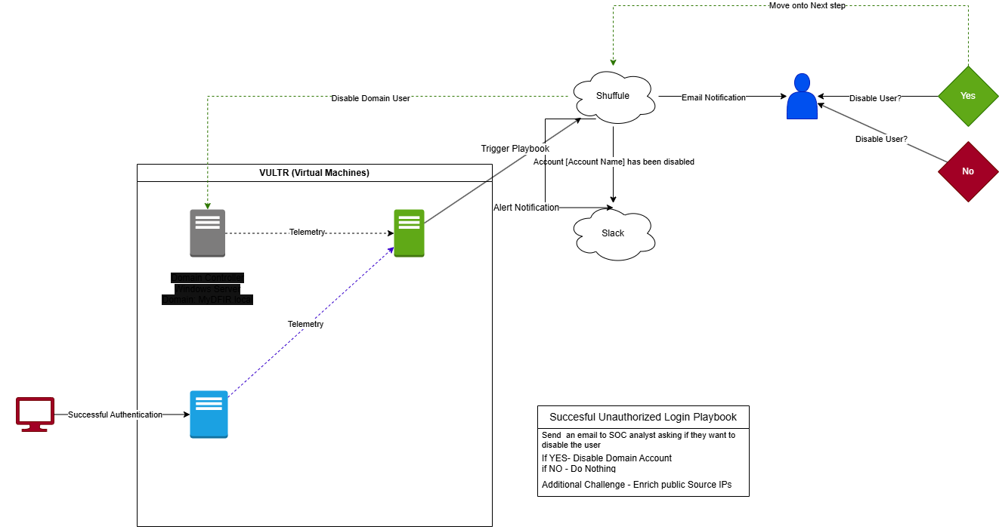
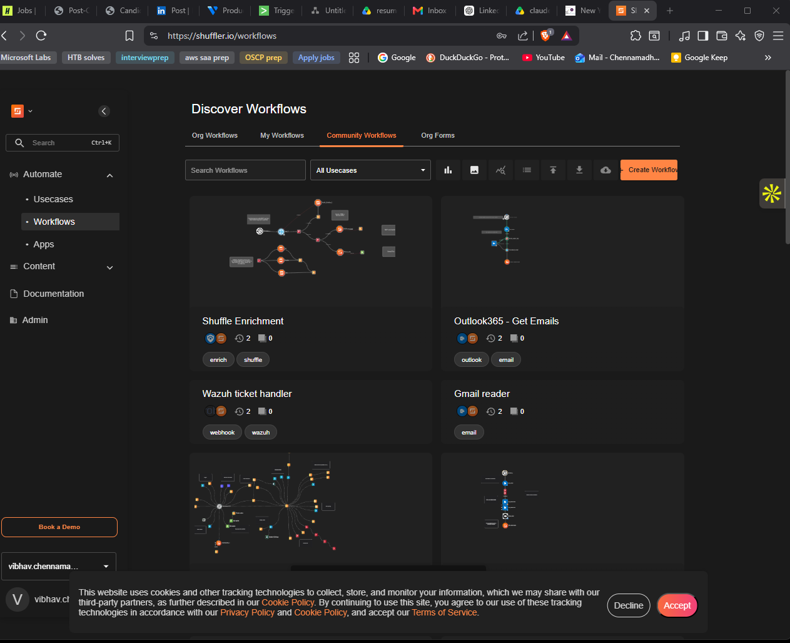

# Active-Directory-SOC-Splunk-Lab


## Overview

This lab simulates a small enterprise SOC pipeline end to end: a Windows Server 2022 domain controller hosting Active Directory Domain Services, a Windows test workstation joined to the domain, and an Ubuntu 22.04 host running Splunk Enterprise as the SIEM. Telemetry from both Windows endpoints is forwarded to Splunk via the Universal Forwarder, where a scheduled correlation search detects unauthorized successful RDP logins (EventCode 4624, Logon Types 7 and 10) originating outside the corporate IP range. When the rule fires, Splunk forwards the alert payload to a Shuffle SOAR workflow that notifies the analyst over a Discord webhook, emails them a yes/no remediation prompt, and — on confirmation — disables the offending user in Active Directory via LDAP. The whole environment runs on Vultr cloud infrastructure inside a single VPC so the analyst experience mirrors a real SOC investigation: detection, triage, decision, response, confirmation.

## Objectives

- Stand up a working Active Directory forest (`MyDFIR.local`) with a domain controller, a domain-joined workstation, and a test user account
- Centralize Windows Security log telemetry from both endpoints into Splunk using the Universal Forwarder on the default indexer port (9997)
- Author a Splunk SPL detection that filters EventCode 4624 by Logon Type and source IP to surface unauthorized successful RDP logins
- Wire a Shuffle SOAR workflow to a Splunk webhook so triggered alerts flow into an automated playbook
- Implement an analyst-in-the-loop response: Discord notification, email decision, AD account disable, confirmation message back to the channel
- Practice cloud network hardening with VPC isolation, Vultr firewall groups, and host-based `ufw` rules

## Architecture



| VM Name | Role | OS | Public IP (Vultr-assigned) | Private VPC IP |
|---------|------|----|---------------------------|----------------|
| `mydfir-ad-dc01` | Active Directory Domain Controller | Windows Server 2022 Standard | `216.x.x.136` | `10.22.96.4` |
| `cloud-instance` (test machine) | Domain-joined Windows workstation | Windows Server 2022 Standard | `155.x.x.10` | `10.22.96.3` |
| `mydfir-splunk` | Splunk Enterprise SIEM + UF receiver | Ubuntu 22.04 LTS | `216.128.x.18` | `10.22.96.5` |

All three VMs sit in the same Vultr VPC in the Toronto region. Inter-VM traffic stays on the `10.22.96.0/20` private subnet; the Vultr firewall group controls anything inbound from the public internet.

## Technologies Used

| Technology | Version | Purpose |
|------------|---------|---------|
| Vultr Cloud | Current platform | Underlying IaaS host for all three VMs and the VPC |
| Windows Server | 2022 Standard | Domain controller and test endpoint OS |
| Active Directory Domain Services | Built-in (Server 2022) | Identity, authentication, group policy |
| Ubuntu Server | 22.04 LTS | Host OS for the Splunk indexer |
| Splunk Enterprise | 9.x (free trial) | SIEM — indexing, search, alerting |
| Splunk Universal Forwarder | 9.x | Ships `WinEventLog:Security` from endpoints to the indexer |
| Splunk Add-on for Microsoft Windows | Latest | Field extractions for `user`, `Logon_Type`, `Source_Network_Address` |
| Shuffle SOAR | Cloud-hosted | Orchestration platform — webhook trigger, branching workflow |
| Discord | N/A | Notification channel via incoming webhook (replaced Slack) |
| LDAP (over port 389) | Built-in to AD | Channel used by the Shuffle AD app to disable accounts |
| `ufw` | 0.36 | Host-based firewall on the Splunk Ubuntu VM |

## Lab Network Design

The lab is built on a single Vultr VPC (`10.22.96.0/20`) in the Toronto region. VPC membership was enabled on each VM after deployment, which forced a reboot and gave each host a second NIC on the private subnet. Out of the box the Windows hosts came up with a `169.254.x.x` APIPA address on that second NIC instead of the expected `10.22.96.x` address, so a static IP, subnet mask, and DNS pointer were configured manually on the Vultr VPC adapter for both Windows VMs.

A single Vultr firewall group (`mydfir-ad-project-2.0`) is applied to all three machines. Rules were added incrementally only as features needed them:

| Port / Protocol | Source | Reason added |
|-----------------|--------|--------------|
| TCP 22 (SSH) | My public IP | Manage the Ubuntu Splunk host from the analyst workstation |
| TCP 3389 (MS-RDP) | My public IP (later widened to `anywhere` for alert testing) | Administer the Windows VMs, then deliberately exposed to generate unauthorized-login telemetry |
| TCP 8000 (Splunk Web) | My public IP | Reach the Splunk web UI from a browser |
| TCP 9997 (Splunk indexer) | VPC peers | Universal Forwarder traffic from the two Windows endpoints into the indexer |
| TCP 389 (LDAP) | Shuffle cloud egress range | Shuffle SOAR's Active Directory app needs to reach the DC to disable accounts |

The Ubuntu Splunk host runs `ufw` in addition to the Vultr firewall — both layers had to be opened for port 8000 (web UI) and 9997 (UF receiver) before traffic could land on the indexer.

## Detection Logic

Windows logs **EventCode 4624** every time an account successfully logs on. The interesting wrinkle for this lab is the Logon Type field:

- **Logon Type 10** — RemoteInteractive: a textbook RDP session
- **Logon Type 7** — Unlock: a previously locked RDP session being unlocked, which still represents an interactive session on the box

Filtering on both types catches the full RDP-style logon footprint. `Source_Network_Address` carries the originating IP; empty or `-` values are local logons and were stripped out to cut noise. For the "authorized vs unauthorized" decision the corporate IP range was assumed to start with `40.`, so anything outside that prefix is treated as unauthorized for the purposes of the demo.

The final search, scheduled to run every minute over the last 60 minutes:

```spl
index=mydfir-ad EventCode=4624 
(Logon_Type=7 OR Logon_Type=10) 
Source_Network_Address=* 
Source_Network_Address!="-" 
Source_Network_Address!=40.*
| stats count by _time, ComputerName, Source_Network_Address, user, Logon_Type
| sort -_time
```

The `stats` line is purely cosmetic — it collapses the noisy raw event into the five fields the analyst actually needs to triage.

## SOAR Workflow

```
 Splunk alert ──HTTP POST──▶ Shuffle webhook
                                  │
                                  ▼
                         Discord (alert channel)
                                  │
                                  ▼
                         Email user-input node
                          ("Disable this user?")
                                  │
                          ┌───────┴───────┐
                         YES              NO
                          │                │
                          ▼                ▼
                Active Directory      (end — no action)
                disable user
                          │
                          ▼
                  Get user attributes
                          │
                  contains "Account disabled"?
                          │
                          ▼
                  Discord (confirmation)
                  "Account <user> has been disabled"
```

Step by step:

1. The Splunk scheduled search fires and POSTs its result JSON to the Shuffle webhook URI.
2. Shuffle's webhook trigger normalizes the payload; runtime arguments like `$exec.result.user`, `$exec.result.Source_Network_Address`, `$exec.result.search_name`, and `$exec.result._time` become available to downstream nodes.
3. A Discord HTTP node posts a formatted alert to the `#alerts` channel of the lab Discord server using the channel's incoming webhook URL.
4. A user-input node emails the analyst inbox asking *"Would you like to disable the user?"* with a True/False link pair.
5. On True, the Active Directory app authenticates over LDAP (server `10.22.96.4`, port 389, base DN `CN=Users,DC=MyDFIR,DC=local`) and runs the **Disable User** action against the user from the alert payload.
6. A follow-up **Get User Attributes** call pulls `userAccountControl`; the workflow branches on whether the response contains `ACCOUNT_DISABLED`.
7. If the disable succeeded, a second Discord node posts the confirmation: `Account: <user> has been disabled.`

## Evidence / Results

**Environment provisioning**


**Active Directory configuration**


**Splunk SIEM**


**Detection and alerting**


**SOAR automation**




## Challenges & Troubleshooting

**Slack OAuth returned "Invalid permissions" when adding the workflow bot.** The Shuffle Slack app installation kept failing at the OAuth consent step on a free Slack workspace — the bot scopes Shuffle requested were not all grantable on the workspace tier I was using. Rather than chase Slack workspace administration, I swapped the notification channel for Discord. Discord's incoming webhooks are a single URL with no OAuth handshake at all, so the HTTP node in Shuffle could post directly with a minimal `{ "content": "..." }` JSON body. The whole channel switch took about ten minutes.

**Shuffle's cloud-hosted Active Directory app failed authentication with an MD4 hash type error.** When the AD node first tried to bind to the DC over LDAP it returned a Python `hashlib` exception referencing MD4 — the underlying Python runtime in the Shuffle cloud worker uses an OpenSSL build that has MD4 disabled by default, and the LDAP NTLM auth path was reaching for it. The workaround was to fall back to a simple bind using the administrator credentials directly, with `useSSL=false` and the search base set to `CN=Users,DC=MyDFIR,DC=local`. Bind succeeded, the **Get User Attributes** call returned data, and **Disable User** worked. A proper fix would be to run a self-hosted Shuffle worker where I control the Python image.

**VPC NICs came up with `169.254.x.x` APIPA addresses instead of `10.22.96.x`.** After enabling VPC on each Windows VM and rebooting, `ipconfig` showed the new "Ethernet instance 02" adapter sitting in the link-local range instead of the VPC's `10.22.96.0/20`. Vultr's portal doesn't push DHCP onto the VPC NIC — the user is expected to configure it statically. Fix was to set the adapter to *Use the following IP address* with the VPC IP from the Vultr UI (`10.22.96.4` on the DC, `10.22.96.3` on the test machine), subnet mask `255.255.240.0`, and DNS pointing at the DC for the domain-joined host. After that, `ping 10.22.96.5` from the DC immediately succeeded.

**Splunk Web on port 8000 was unreachable after the Vultr firewall rule was added.** I added the TCP/8000 rule scoped to my IP in the Vultr firewall group, refreshed the browser, and still got a connection timeout. The Ubuntu host was running `ufw` and had its own default-deny inbound policy. Running `ufw allow 8000` on the Splunk host made the UI load instantly. The same dual-firewall pattern bit me again on 9997 for the UF receiver — both layers had to be open.

**Splunk reported IOWait performance warnings on first login.** The cloud VM's shared CPU spec for the Splunk host (4 vCPU / 8 GB / 160 GB) is fine for a lab but Splunk flagged elevated IOWait during the initial indexing of historical Windows events. I noted it, confirmed disk wasn't actually saturated, and moved on — for a production deployment this would push me to dedicated CPU and an NVMe-backed disk.

**Universal Forwarder install on the test machine wouldn't accept the local JSmith user.** The Universal Forwarder MSI launches its service under a Windows account, and the test workstation was logged in as `JSmith` — a regular domain user without local admin. The installer threw on the service-account step. Logging out and re-launching the MSI under `MyDFIR\Administrator` (using the domain admin credentials from the Vultr portal) let the install complete; the service was then reconfigured to run under `LocalSystem` so it could read the `WinEventLog:Security` channel.

**`inputs.conf` had to be hand-created in `etc\system\local\`.** A fresh Universal Forwarder install only ships `inputs.conf` under `etc\system\default\`, and Splunk best practice is to layer overrides in `local\` rather than edit defaults. I copied the file across, opened it in Notepad-as-admin, appended:

```conf
[WinEventLog://Security]
index = mydfir-ad
disabled = false
```

then restarted the **SplunkForwarder** service from `services.msc`. Events started landing in the `mydfir-ad` index within a few seconds.

## Lessons Learned

- **Two firewalls means two rules.** Cloud-platform firewalls and host firewalls (`ufw`, Windows Defender Firewall) are independent. A rule in one isn't a rule in the other, and silent timeouts during testing almost always trace back to the layer I forgot.
- **A VPC isn't automatically configured — it's just provisioned.** Enabling the VPC checkbox in Vultr only adds the NIC. Static IP, mask, gateway, and DNS still have to be set on the guest, and DNS in particular is the one that breaks the domain join with a generic "domain not found" error.
- **Logon Type matters more than EventCode.** EventCode 4624 alone is far too noisy in any real environment. Combining it with Logon Types 7 and 10 narrows the search to interactive/remote-interactive sessions, which is the actual attacker tradecraft worth alerting on.
- **Cloud SOAR is convenient but constrained.** The Shuffle cloud worker's MD4-disabled OpenSSL build silently broke the LDAP NTLM path, and there was no way to swap the runtime. For anything past a lab, self-hosting the worker is the right answer.
- **Analyst-in-the-loop is cheap to add.** The user-input node turned a one-shot "auto-disable" playbook into a triage flow — alert, prompt, confirm, act, confirm again — for about five minutes of extra work. That pattern scales to almost any response action.

## Future Improvements

- [ ] Migrate Shuffle to a self-hosted instance to resolve the MD4 LDAP issue and unblock the Disable User action via NTLM bind
- [ ] Integrate Wazuh HIDS alongside Splunk for host-based detection and file integrity monitoring
- [ ] Build a Splunk dashboard for RDP login analytics — geolocation, top source IPs, login type breakdown, failed-vs-successful ratio
- [ ] Expand detection coverage to brute force activity (EventCode 4625) and add a correlation rule for N failures followed by a 4624 from the same source
- [ ] Implement pfSense between the analyst workstation segment and the lab segment to practice network segmentation and IDS placement

## Prerequisites

- Vultr account (or any cloud provider that supports Windows Server 2022 and Ubuntu 22.04, plus a VPC feature)
- Valid payment method linked to the cloud account
- Local RDP and SSH clients
- A Splunk.com account for downloading Splunk Enterprise and the Universal Forwarder
- A Shuffle SOAR account (cloud is sufficient for the demo; self-hosted preferred long term)
- A Discord account and a server you control for the webhook
- Basic familiarity with Windows administration and Linux command line

## How to Replicate

Follow the docs in order:

1. [01 — Environment Setup](docs/01-environment-setup.md) — Vultr VMs, firewall group, VPC, static IP fix
2. [02 — Active Directory Configuration](docs/02-active-directory-config.md) — AD DS install, forest creation, test user, domain join
3. [03 — Splunk Configuration](docs/03-splunk-configuration.md) — Splunk install, Universal Forwarder deployment, telemetry verification
4. [04 — Detection and Alerting](docs/04-detection-and-alerting.md) — EventCode 4624 SPL search, scheduled alert
5. [05 — SOAR Automation](docs/05-soar-automation.md) — Shuffle workflow, Discord webhook, analyst email, AD disable

For external references, tool versions, and the MITRE ATT&CK techniques demonstrated, see [references.md](references.md).
