# Part 1 — Environment Setup

## Objective

This phase provisions the three virtual machines that the lab runs on — a Windows Server 2022 host that will become the domain controller, a second Windows Server 2022 host that will act as a domain-joined workstation, and an Ubuntu 22.04 server that will run Splunk — and wires them together over a Vultr VPC. The networking pieces here are not optional plumbing; they decide whether the rest of the project works. The static IP fix in particular is what lets the Splunk Universal Forwarder reach the indexer on the private subnet, and it's also what lets the domain controller's DNS get resolved by the test machine during the domain join in Part 2.

## Prerequisites

- A Vultr account with a linked credit card (new accounts qualify for $300 credit)
- Local RDP client (Windows: `mstsc.exe`)
- Local SSH client (PowerShell on Windows ships with one)
- Public IP of the analyst workstation (used to scope inbound firewall rules)

## Steps

### Vultr VM deployment

Three VMs were deployed in the Toronto region under **Compute → Shared CPU**:

| VM | Specs | OS | Hostname |
|----|-------|----|---------|
| Domain controller | 2 vCPU, 4 GB RAM, 80 GB disk (~$52/mo with Windows licensing) | Windows Server 2022 Standard | `mydfir-ad-dc01` |
| Test machine | 1 vCPU, 2 GB RAM, 55 GB disk | Windows Server 2022 Standard | `cloud-instance` (default) |
| Splunk indexer | 4 vCPU, 8 GB RAM, 160 GB disk | Ubuntu 22.04 LTS | `mydfir-splunk` |

Automatic backups were disabled on all three to keep the lab cost down.

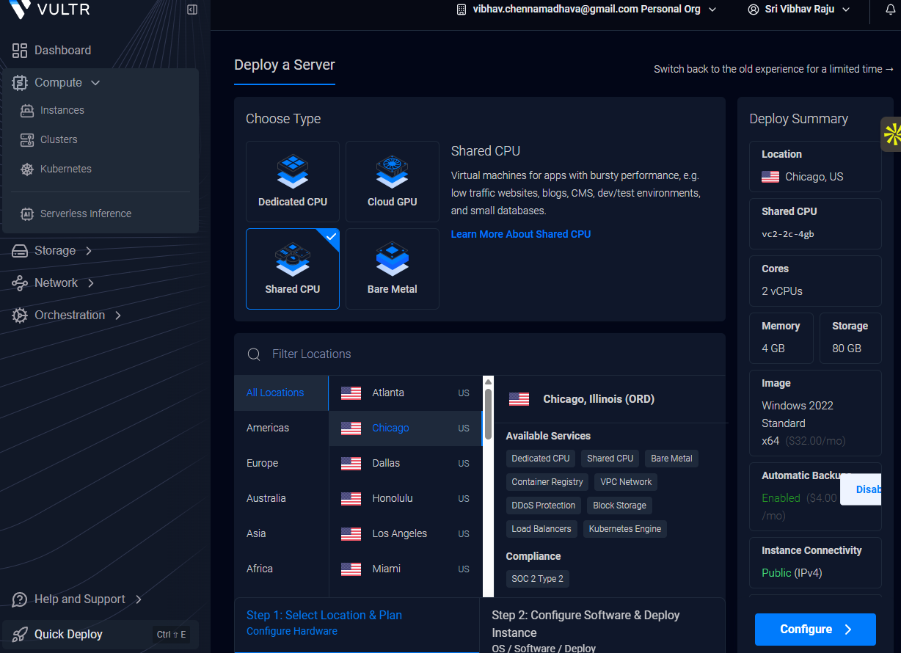
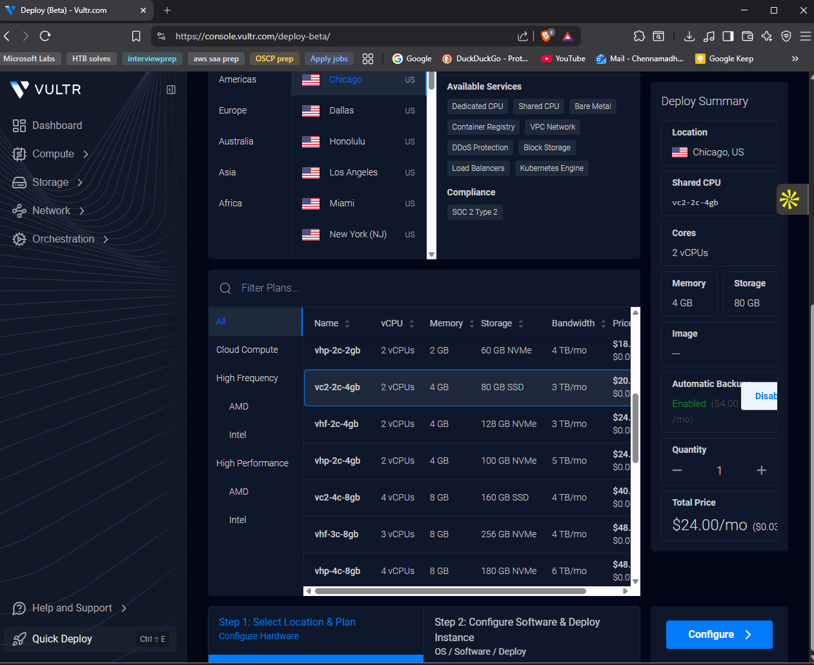

### Firewall group creation

A single firewall group named `mydfir-ad-project-2.0` was created under **Network → Firewall** and applied to all three VMs. The default permissive SSH rule was tightened so SSH was only reachable from the analyst's public IP (set via the *My IP* shortcut). An MS-RDP rule (TCP/3389) was added with the same source restriction so the Windows VMs could be administered from the same workstation. TCP/8000 for Splunk Web was added once Splunk was installed in Part 3.

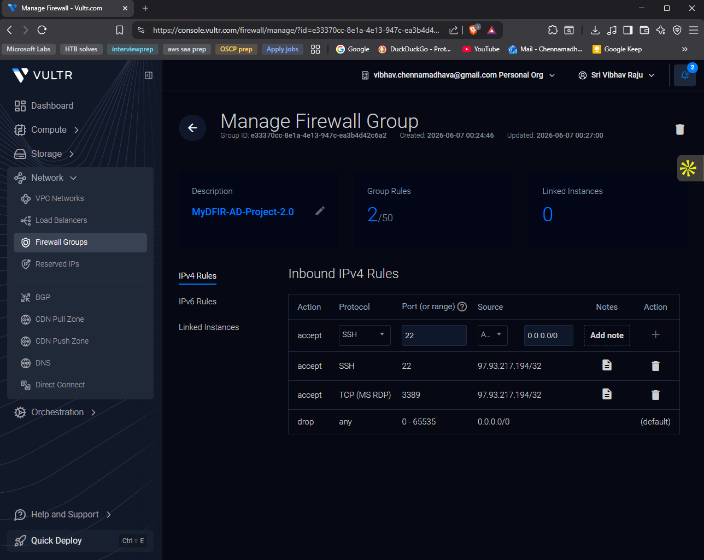
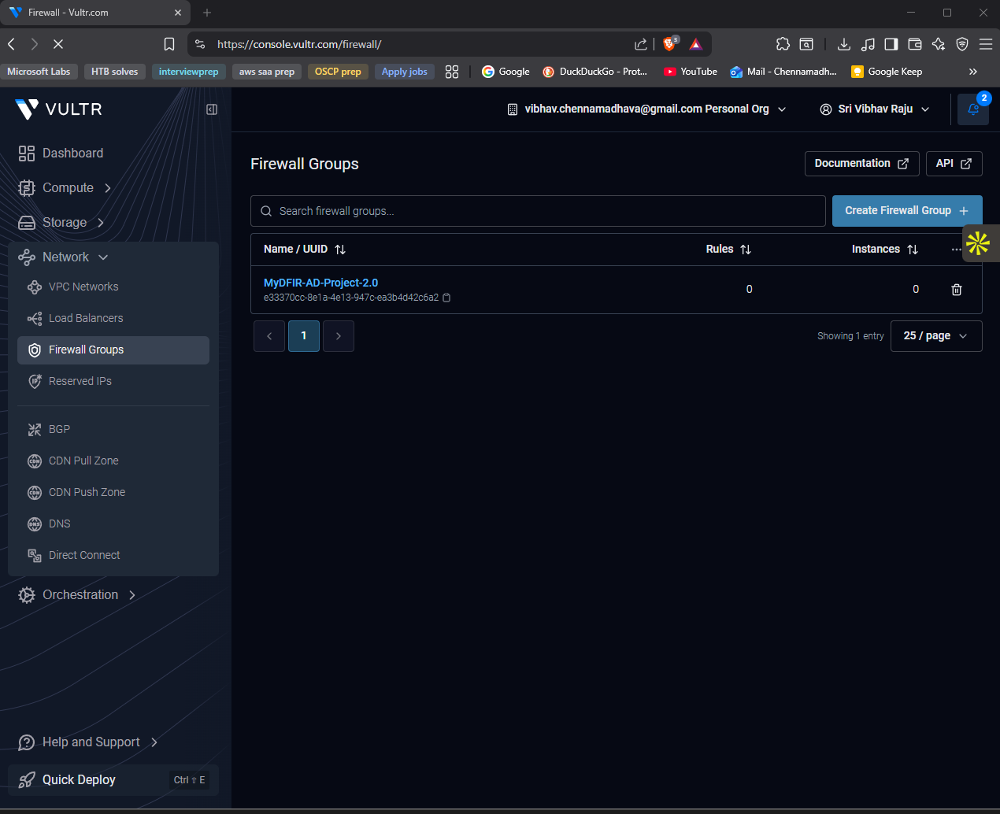

### Recording public IPs

The public IP of each VM was captured to a scratch Notepad immediately after deployment — these come up repeatedly during configuration (RDP target, SSH target, Splunk receiving indexer, etc.).

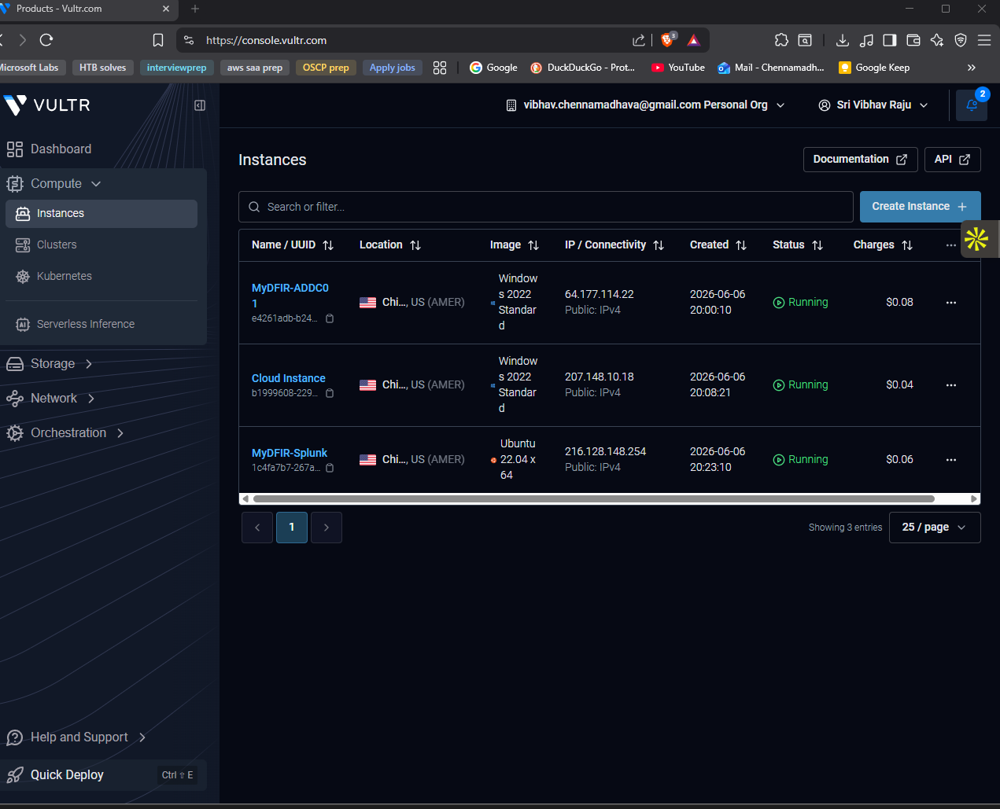

### VPC enablement

Under each VM's **Settings → VPC Network** tab, the *Enable VPC* toggle was switched on. Vultr assigns a private IP automatically: `10.22.96.3` to the test machine, `10.22.96.4` to the domain controller, `10.22.96.5` to the Splunk host. Enabling VPC restarts the VM.

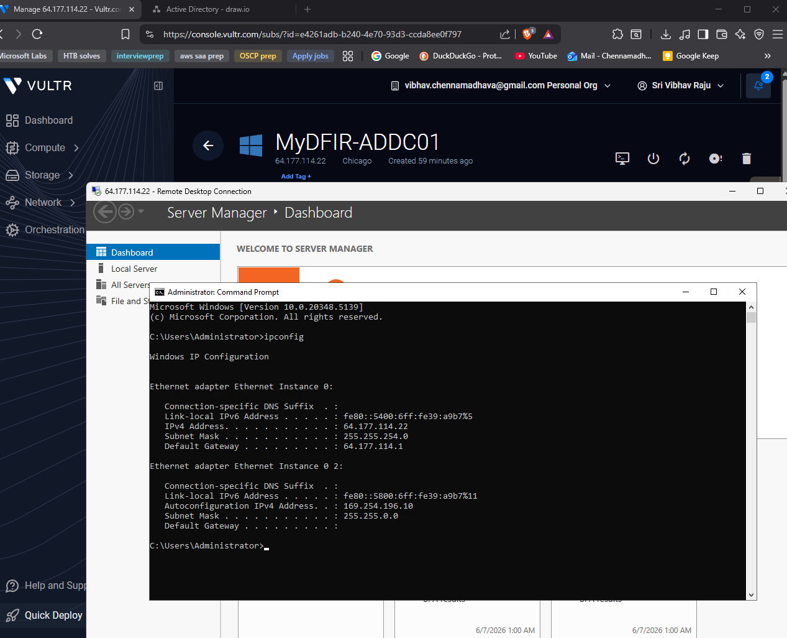

### Static IP assignment on the VPC NIC (fixing the 169.x issue)

After enabling VPC and rebooting, both Windows VMs came up with the new "Ethernet instance 02" NIC sitting on a `169.254.x.x` APIPA address rather than the expected `10.22.96.x` address. Vultr's VPC does not run DHCP — the guest has to be told its IP statically.

On each Windows VM:

1. Open **Network and Internet settings → Change adapter options**
2. Right-click **Ethernet instance 02 → Properties**
3. Double-click **Internet Protocol Version 4 (TCP/IPv4)**
4. Select **Use the following IP address** and enter the values from the Vultr VPC tab:
   - IP address: `10.22.96.4` (DC) / `10.22.96.3` (test)
   - Subnet mask: `255.255.240.0`
   - Default gateway: *(left blank — VPC peers don't need one)*
   - Preferred DNS server: *(left blank on the DC, set to the DC's VPC IP on the test machine for the domain join)*

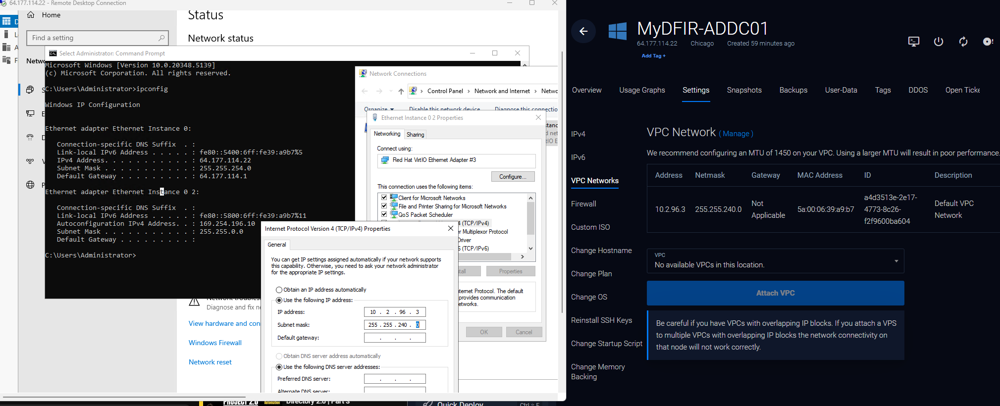
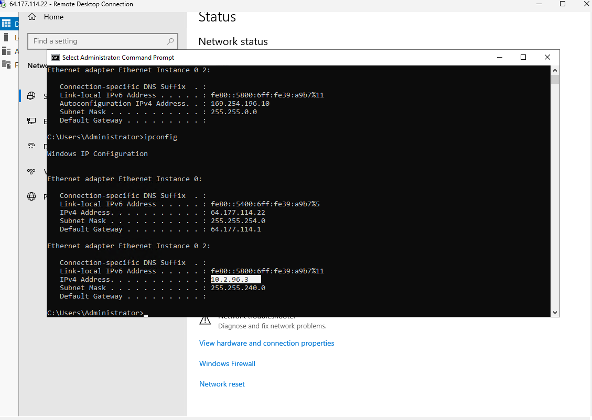
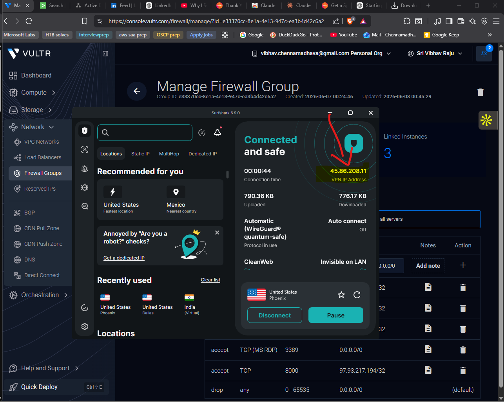

### Splunk host VPC configuration

The Ubuntu Splunk host was reached over SSH from PowerShell:

```bash
ssh root@<splunk-public-ip>
```

The VPC checkbox was enabled the same way as the Windows VMs. Because that triggers a reboot, the SSH session dropped and was re-established. Verified the new NIC came up with `10.22.96.5`:

```bash
ip a
```

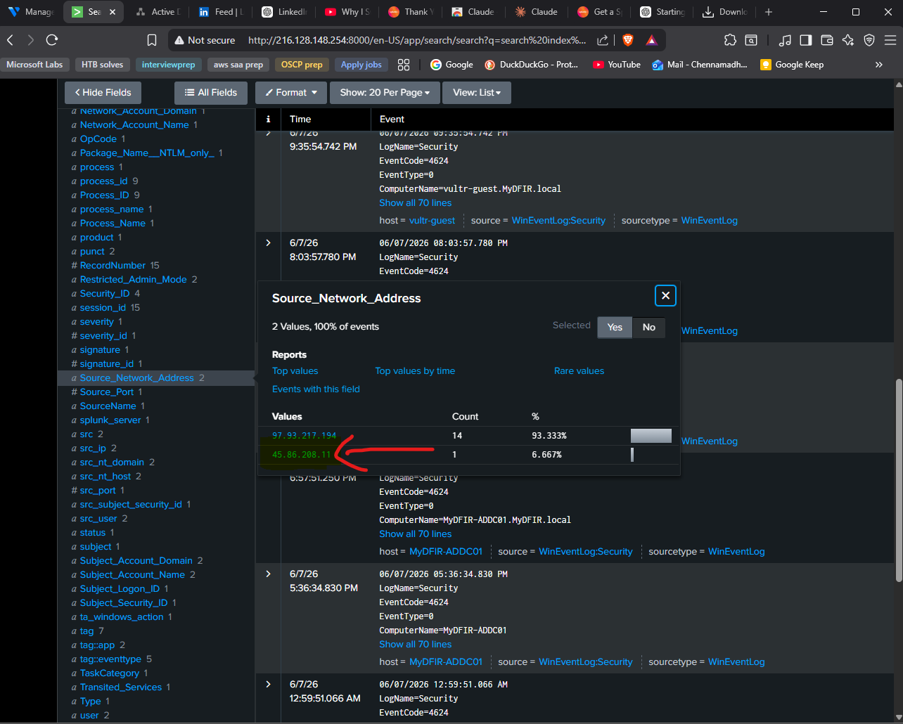

### Connectivity verification

From the Splunk host, the other two VPC peers were pinged to confirm L3 reachability across the private subnet:

```bash
ping -c 4 10.22.96.3   # test machine
ping -c 4 10.22.96.4   # domain controller
```

Initial pings returned *destination host unreachable* — the consequence of the still-broken `169.x` adapters on the Windows side. After the static IP fix above was applied, both pings returned immediately.

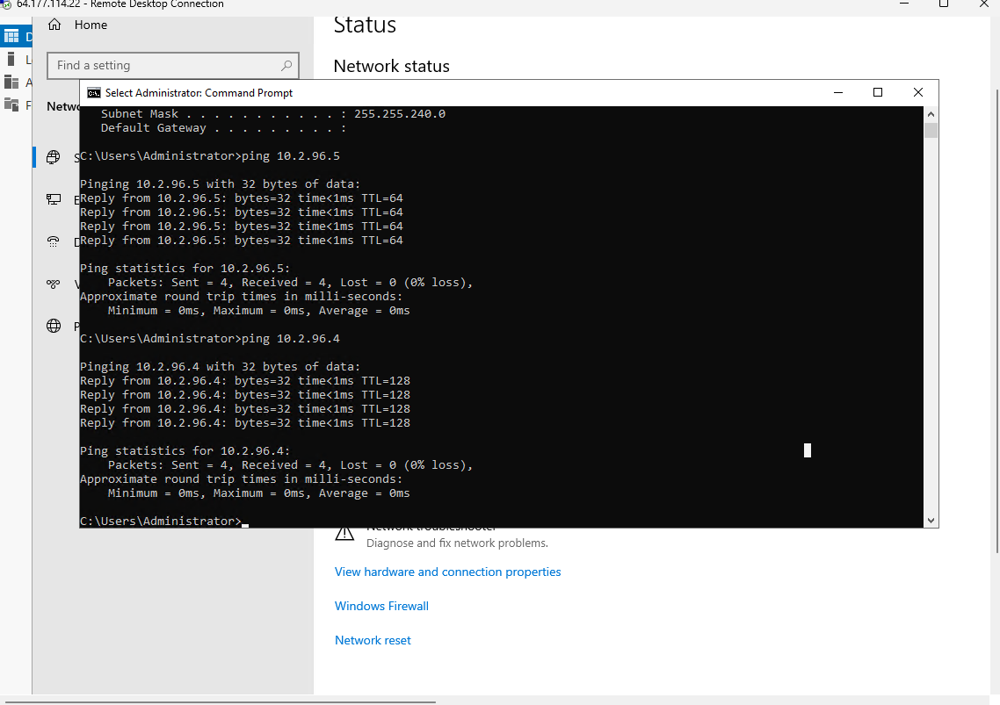

## Verification

This phase is complete when:

- All three VMs show **Running** in the Vultr panel
- Each VM has the `mydfir-ad-project-2.0` firewall group attached
- `ipconfig` on each Windows VM shows `10.22.96.x` on Ethernet instance 02 (not `169.254.x.x`)
- `ip a` on the Ubuntu host shows `10.22.96.5` on the VPC NIC
- `ping 10.22.96.5` from the DC, and `ping 10.22.96.4` / `ping 10.22.96.3` from the Splunk host all succeed

## Troubleshooting

**`169.254.x.x` on the VPC NIC after enabling VPC.** APIPA — the guest didn't get a DHCP lease because the VPC doesn't run one. Fix is the static IP configuration described above.

**Console paste not working on Windows VMs.** Vultr's web console doesn't accept paste directly; the *Show extra keys → Clipboard* widget has to be used to push the password into the guest. RDP from a local client avoids the problem entirely.

**Vultr asking for a $5 deposit instead of granting the $300 credit.** Some card BINs hit this. Either deposit the $5 or try a different card — the credit applies as soon as the card verification clears.

## Key Concepts

- **VPC (Virtual Private Cloud)** — a logically isolated network inside the cloud provider. VMs in the same VPC + region can talk to each other over a private subnet without traversing the public internet. This is the closest cloud analogue to a flat L2 lab network at home.
- **APIPA (`169.254.0.0/16`)** — what a Windows interface self-assigns when DHCP fails. Seeing it on a "should-be-DHCP" interface is a signal that the upstream DHCP didn't answer, not a sign the interface is broken.
- **Layered firewalling** — the Vultr firewall group controls north-south traffic at the platform edge; the host's own firewall (`ufw` on Ubuntu, Windows Defender Firewall on Windows) controls what the kernel actually accepts. Both have to be open for a flow to work.
