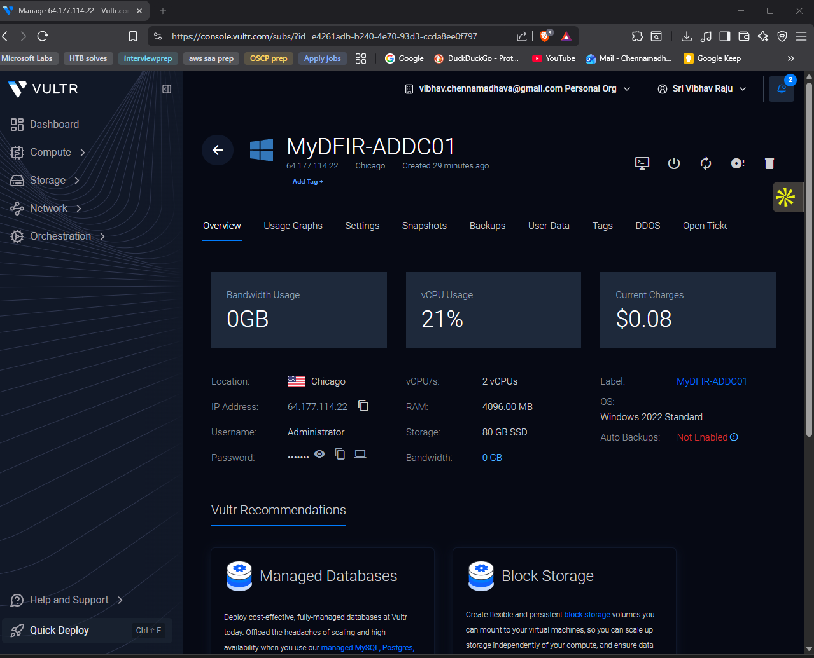
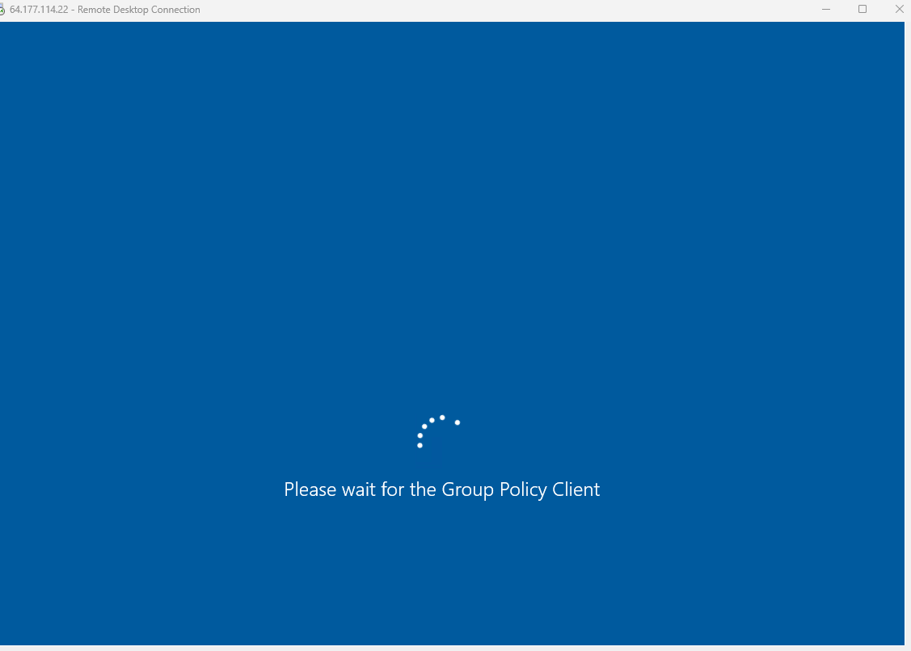
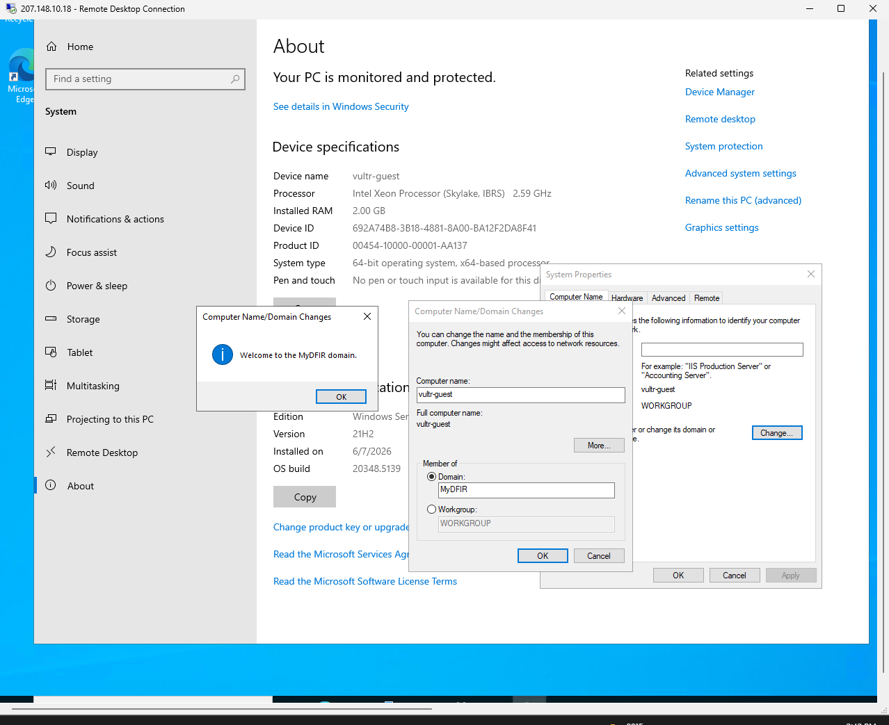
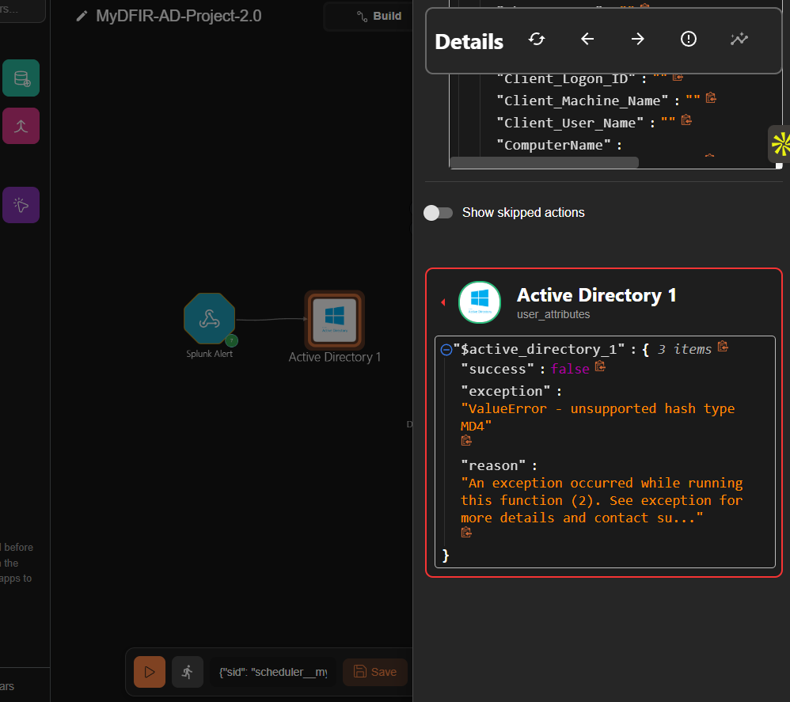
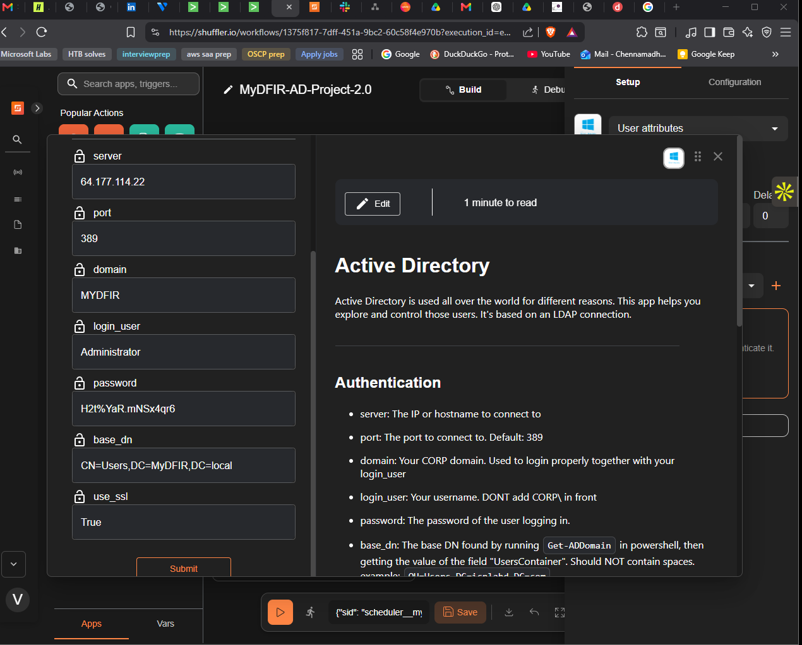
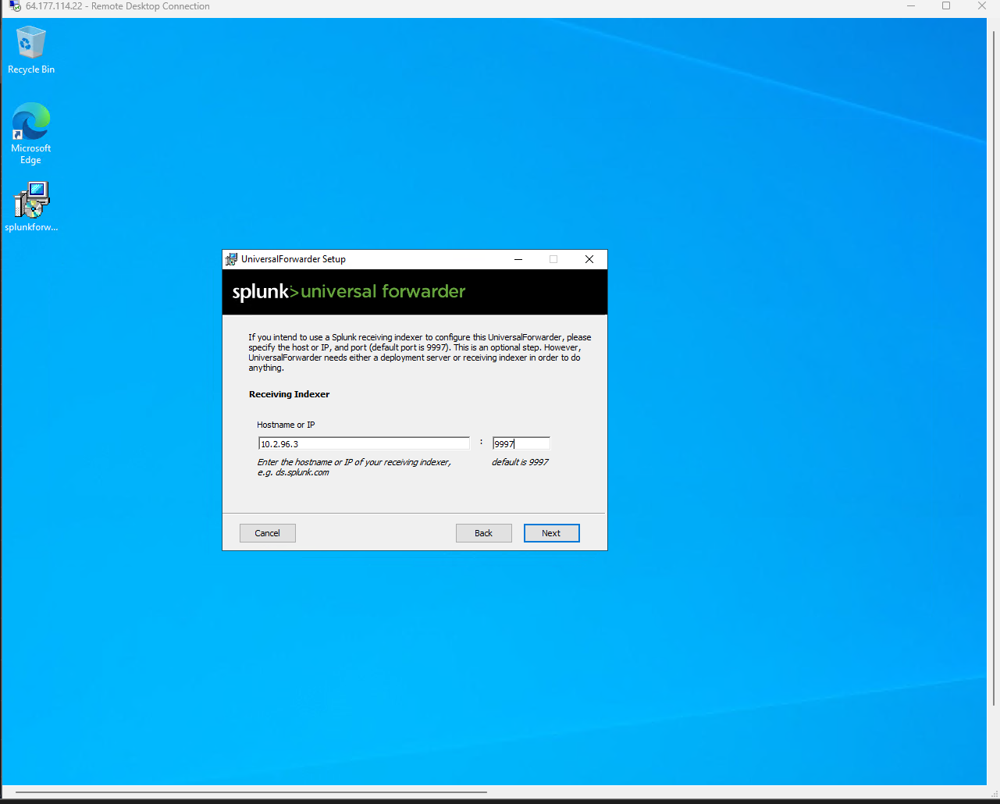
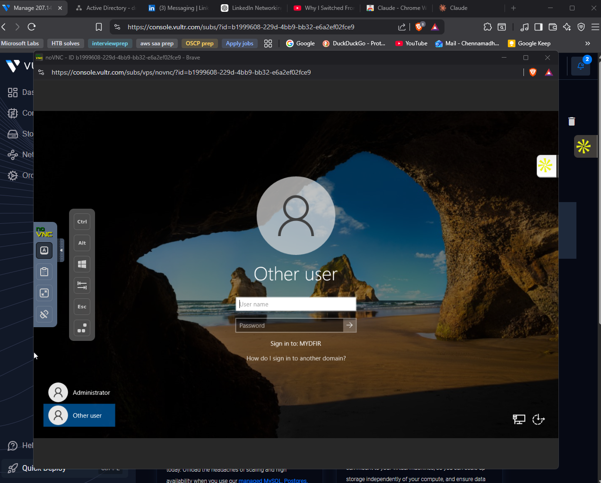

# Part 2 — Active Directory Configuration

## Objective

This phase turns the bare Windows Server 2022 host into a working Active Directory environment. The AD DS role is installed, the server is promoted to the first domain controller of a new forest (`MyDFIR.local`), a test user is created, and the second Windows VM is joined to the domain. From this point on the lab has a directory of identities that subsequent phases can detect against and respond to — which is the entire reason a SOC cares about AD in the first place.

## Prerequisites

- Both Windows VMs deployed, in the same VPC, on `10.22.96.0/20`
- RDP reachable from the analyst workstation to both VMs
- Static IP configuration applied to the VPC NIC on both VMs (Part 1)
- Administrator password for each VM (visible in the Vultr panel)

## Steps

### Installing the AD DS role

RDP into `mydfir-ad-dc01` as `Administrator`. In Server Manager:

1. **Manage → Add Roles and Features → Next** through the wizard
2. Select **Active Directory Domain Services** when prompted, accept the *Add Features* dialog
3. Continue with defaults, click **Install**

The post-install banner reads *Configuration required. Installation succeeded on mydfir-ad-dc01.*

### Promoting the server to a domain controller

The yellow warning flag at the top of Server Manager links to **Promote this server to a domain controller**. In the deployment wizard:

- **Add a new forest** (no existing forest yet)
- Root domain name: `MyDFIR.local`
- DSRM password: a non-trivial password (the default policy blocks weak ones — `password` was rejected with *verification of safe mode password failed*)
- Click through the remaining defaults and **Install**

The server signs out automatically and reboots. After it comes back up, search "Active" from the Start menu — **Active Directory Users and Computers** is now present, which confirms the promotion succeeded.

### Creating the Jenny Smith test user

In ADUC, expanded the `MyDFIR.local` forest → right-clicked **Users → New → User**:

- First name: `Jenny`
- Last name: `Smith`
- User logon name: `JSmith`
- Password: `Winter2025!`
- Unchecked **User must change password at next logon**
- Checked **Password never expires** (lab convenience — not a setting that belongs in production)

### Joining the test machine to the domain

RDP into the test workstation as the local `Administrator`. **This PC → Properties → Rename this PC (Advanced) → Change**, then:

- Member of → **Domain** → `MyDFIR`
- Authenticate as `Administrator` with the DC's admin password

The first attempt failed with *the specified domain either does not exist or cannot be contacted* — a DNS resolution failure. The test machine's preferred DNS server was blank, so it had no way to resolve `MyDFIR.local`. Fix:

1. **Change adapter options → Ethernet instance 02 → Properties → IPv4 → Preferred DNS server: `10.22.96.4`** (the DC's VPC IP)
2. Retry the domain join

This time it succeeded with *Welcome to the MyDFIR domain*. The machine prompted for a reboot.

### Configuring RDP access for the domain user

After the reboot, the test machine's logon screen now shows *Sign in to: MYDFIR*, confirming the domain trust. Logging on as `MyDFIR\JSmith` from the console worked immediately.

The interesting failure happened on RDP from the analyst workstation: `JSmith` / `Winter2025!` returned *the connection was denied because the user account is not authorized for remote login*. Standard domain users are not in the local **Remote Desktop Users** group by default.

Fix, from the test machine's console as `Administrator`:

1. Search `remote` → **Allow remote connections to this computer**
2. **Show settings → Select Users → Add → `JSmith` → Check Names → OK**
3. Retry RDP as `MyDFIR\JSmith`

The second RDP attempt landed straight on Jenny's desktop.

## Verification

This phase is complete when:

- `dsa.msc` (Active Directory Users and Computers) is present on the DC and the `MyDFIR.local` forest is visible
- The `JSmith` user exists under `Users` in the DC's directory tree
- The test machine's logon screen shows *Sign in to: MYDFIR*
- `JSmith` can RDP into the test machine from the analyst workstation as `MyDFIR\JSmith`
- An ADUC search for `Jenny Smith` returns the user

## Troubleshooting

**Domain join fails with *the specified domain either does not exist or cannot be contacted*.** The joining machine can't resolve the domain name. On the joining machine, set the preferred DNS server on the VPC NIC to the DC's VPC IP (`10.22.96.4`) and try again.

**`The connection was denied because the user account is not authorized for remote login`.** The user is a domain user, not a member of the local Remote Desktop Users group on the target. Add the user via **System Properties → Remote → Select Users** on the target machine.

**`Logon attempt failed` even with the correct password.** The username didn't include the domain prefix and Windows resolved it as a local account. Use `MyDFIR\JSmith` instead of bare `JSmith`.

**DSRM password rejected with *verification of safe mode password failed*.** Windows applied default complexity requirements (length, mixed case, etc.). Pick something stronger than `password`.

## Key Concepts

- **Domain controller** — a server that hosts Active Directory Domain Services and answers authentication, authorization, and directory queries for the domain. The DC is the source of truth for who exists and what they can do.
- **Forest, domain, OU** — the forest is the top-level security boundary; a domain is an administrative partition inside it; OUs are containers for policy targeting. This lab has one forest, one domain, default OUs.
- **DNS and AD are inseparable** — domain join, group policy, and the Splunk Universal Forwarder all locate the DC via DNS service records (`_ldap._tcp.dc._msdcs.MyDFIR.local`). If DNS is wrong, AD looks broken.
