# Part 3 — Splunk Configuration

## Objective

This phase installs Splunk Enterprise on the Ubuntu host, configures it to receive forwarded telemetry from both Windows endpoints, and confirms that Security event logs are landing in the `mydfir-ad` index. A SIEM is only as useful as the data it sees — getting the pipe between endpoint and indexer right is what makes Part 4 (detection) and Part 5 (response) possible.

## Prerequisites

- Splunk.com account (free, used to download both Splunk Enterprise and the Universal Forwarder)
- All three VMs running, with the static-IP VPC fix from Part 1 applied
- Domain controller and test machine joined to `MyDFIR.local` (Part 2)
- Vultr firewall group already restricting SSH/RDP to the analyst's public IP

## Steps

### Updating the Ubuntu host

SSH'd into the Splunk VM from PowerShell:

```bash
ssh root@<splunk-public-ip>
apt-get update
apt-get upgrade -y
```

### Downloading and installing Splunk Enterprise

The 64-bit Ubuntu `.deb` was pulled from the Splunk Enterprise free-trial download page. The download URL was right-clicked → *Copy link address*, then `wget`'d into the home directory of the Splunk VM. Installed with:

```bash
ls
dpkg -i splunk-*.deb
```

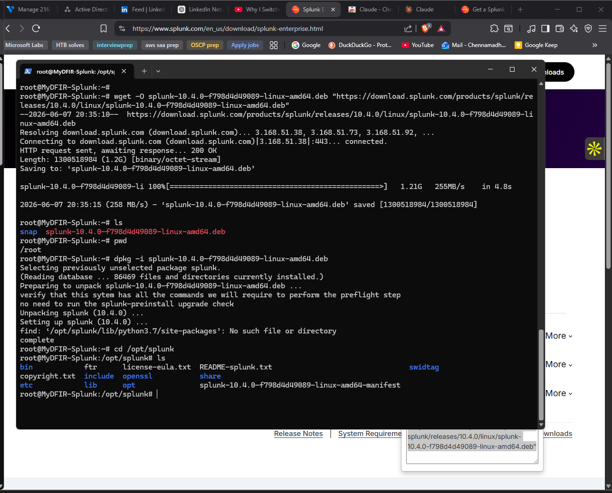
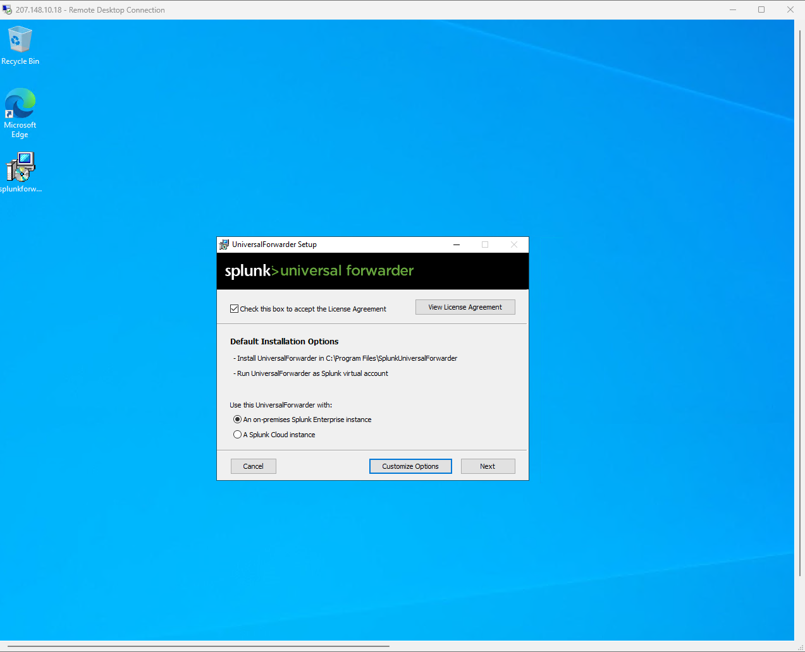

### First-run and admin account

The Splunk binary was started and accepted the EULA inline:

```bash
cd /opt/splunk/bin
./splunk start
```

Held `space` to scroll the license, typed `y` at the prompt. The administrator username was set to `mydfir` with a strong password during the first-run wizard.

### Accessing the web UI on port 8000

From the analyst workstation browser, navigated to `http://<splunk-public-ip>:8000`. The page hung — the Vultr firewall group did not yet have port 8000 in it.

Added a TCP/8000 rule to the firewall group scoped to the analyst's public IP via **Vultr → Network → Firewall → Manage → +**:

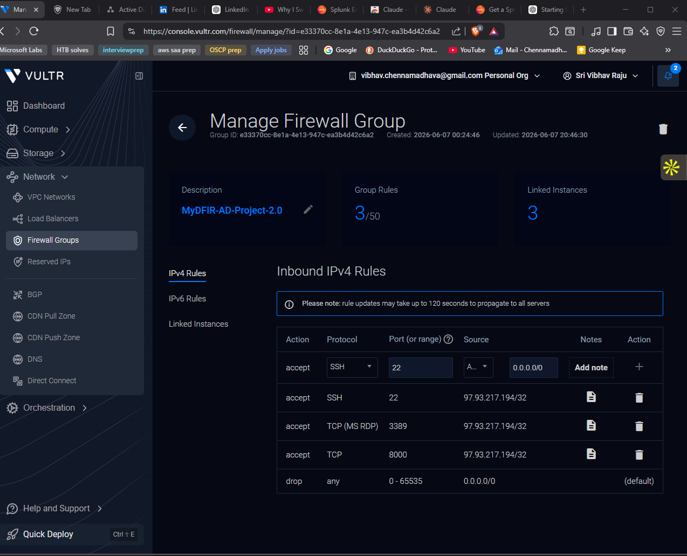

The browser still timed out. The Ubuntu host's `ufw` was also blocking. Fixed with:

```bash
ufw allow 8000
```

The Splunk login page loaded immediately on the next refresh. Logged in as `mydfir`.

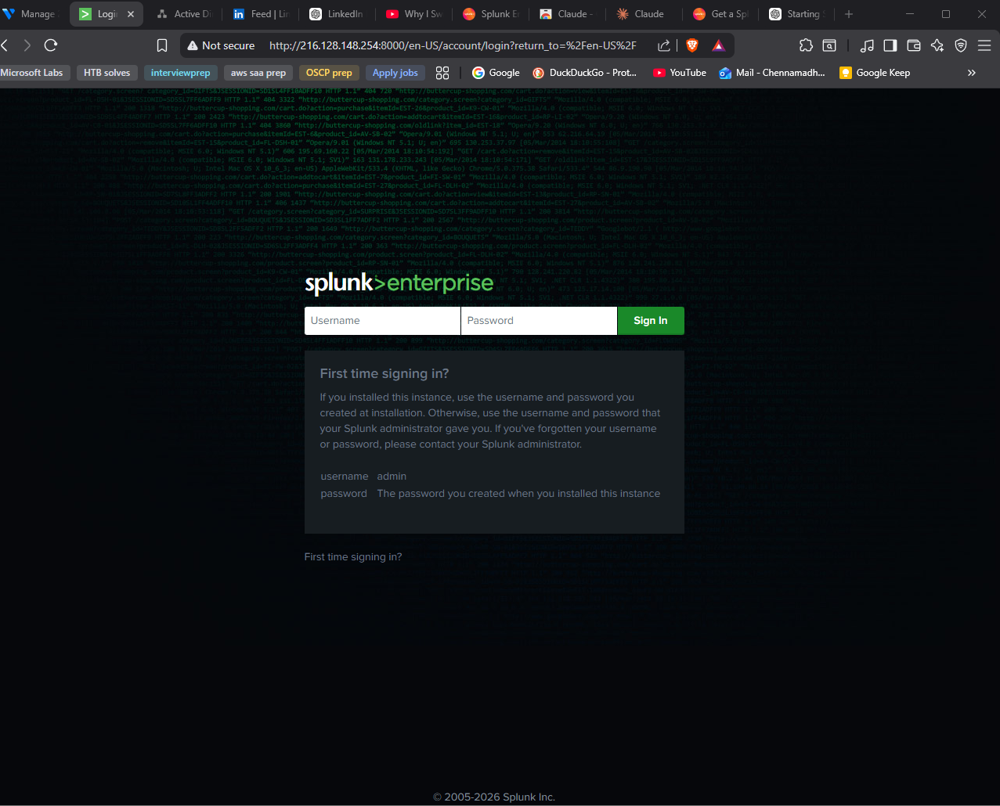

### Setting time zone

Under **Account → Preferences**, the time zone was set to **GMT** so all indexed events display in a single canonical timezone — keeps timestamps comparable across Splunk, Discord, and Shuffle's runtime arguments.

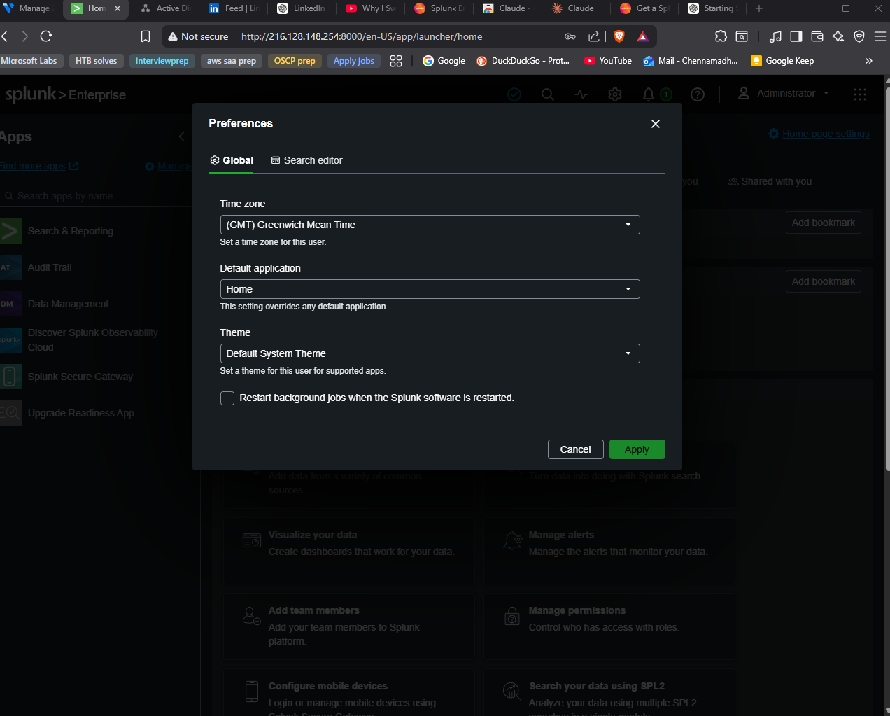

### Installing the Splunk Add-on for Microsoft Windows

Under **Apps → Find more apps**, searched `windows` and installed **Splunk Add-on for Microsoft Windows**. The add-on supplies the field extractions (`user`, `Logon_Type`, `Source_Network_Address`, `ComputerName`) that the Part 4 SPL relies on — without it, those fields don't get parsed out of the raw event XML and the alert can't filter on them.

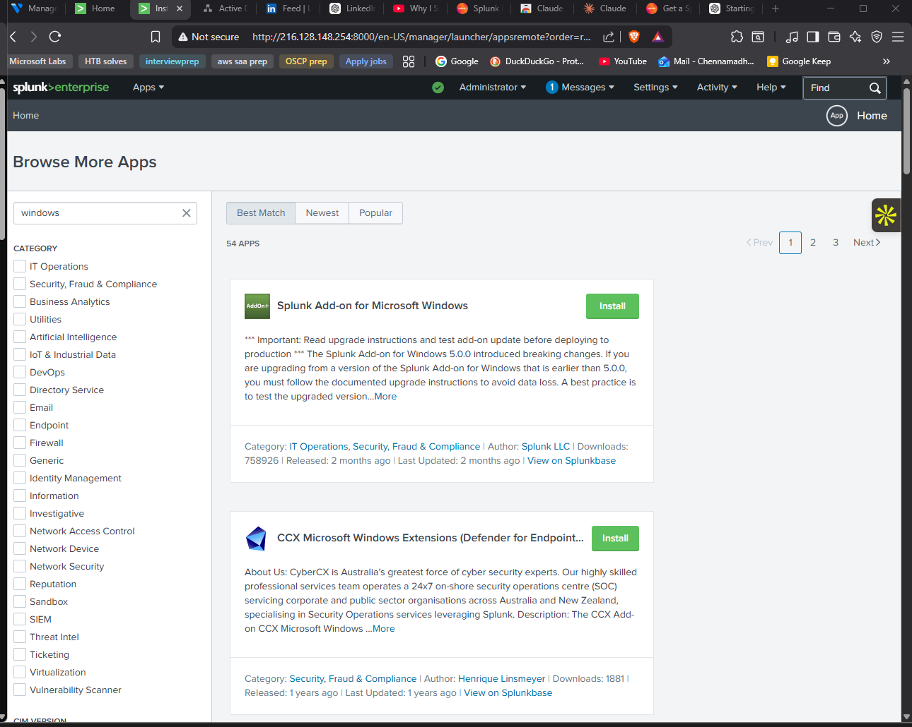

### Creating the `mydfir-ad` index

**Settings → Indexes → New Index**:

- Index name: `mydfir-ad`
- Defaults left for everything else

This is the destination index referenced in the `inputs.conf` on each Universal Forwarder.

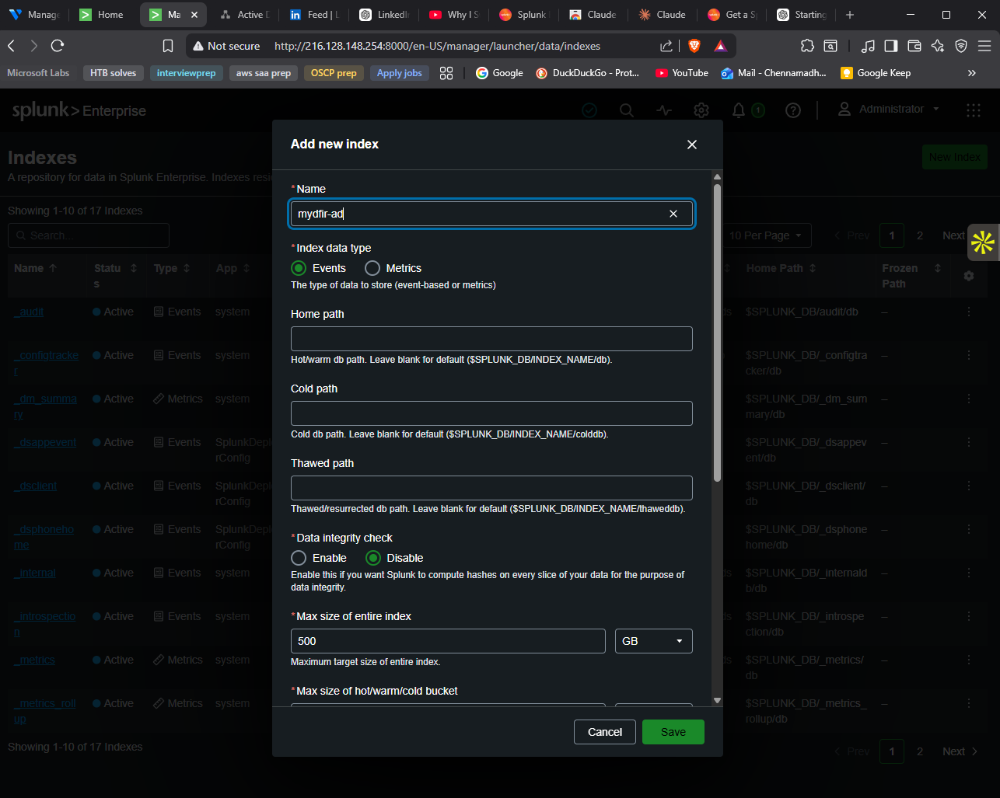

### Enabling the indexer receiving port (9997)

**Settings → Forwarding and receiving → Configure receiving → New Receiving Port → 9997**.

Port 9997 was chosen because it is Splunk's default Universal Forwarder ingest port — keeping the default makes the UF installer's "Receiving Indexer" field exactly match without configuration drift.

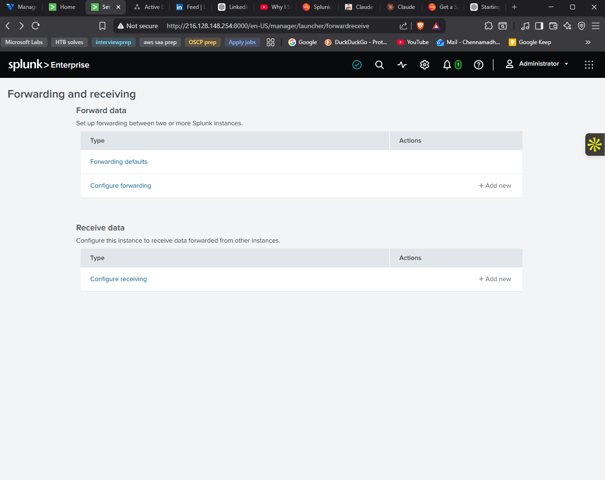

### Universal Forwarder deployment — test machine

The 64-bit Windows MSI was downloaded from the Splunk Universal Forwarder page and dragged into the RDP session.

The test machine was logged in as `JSmith`, who is a regular domain user without local admin. The MSI prompted for elevated credentials at the service-account step; supplied `MyDFIR\Administrator` (DC admin password from Vultr panel — manually typed because the RDP session blocked clipboard paste into the elevation prompt).

In the installer:

- Accepted EULA
- Selected *On-premises Splunk Enterprise instance*
- Username: `mydfir`
- Deployment server: skipped
- Receiving indexer: `10.22.96.5:9997` (Splunk's VPC IP)

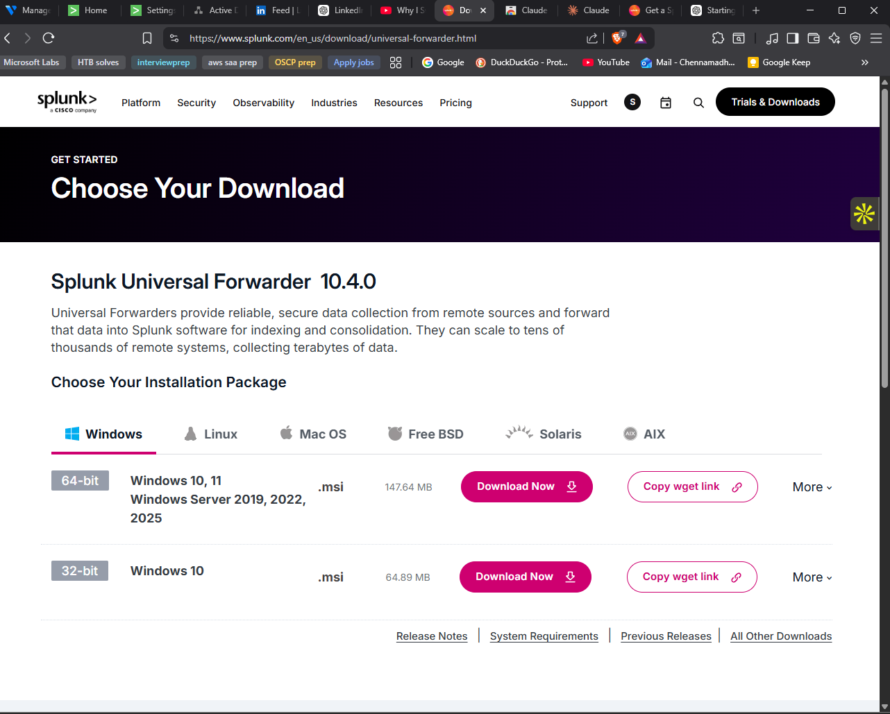

After install, the Security event channel still needed to be wired up. The Universal Forwarder ships `inputs.conf` only under `etc\system\default\`, so a copy was made into `etc\system\local\`:

```
C:\Program Files\SplunkUniversalForwarder\etc\system\default\inputs.conf
                                              ↓ copy
C:\Program Files\SplunkUniversalForwarder\etc\system\local\inputs.conf
```

Notepad was launched as Administrator (right-click → *Run as administrator*) and the following stanza appended:

```conf
[WinEventLog://Security]
index = mydfir-ad
disabled = false
```

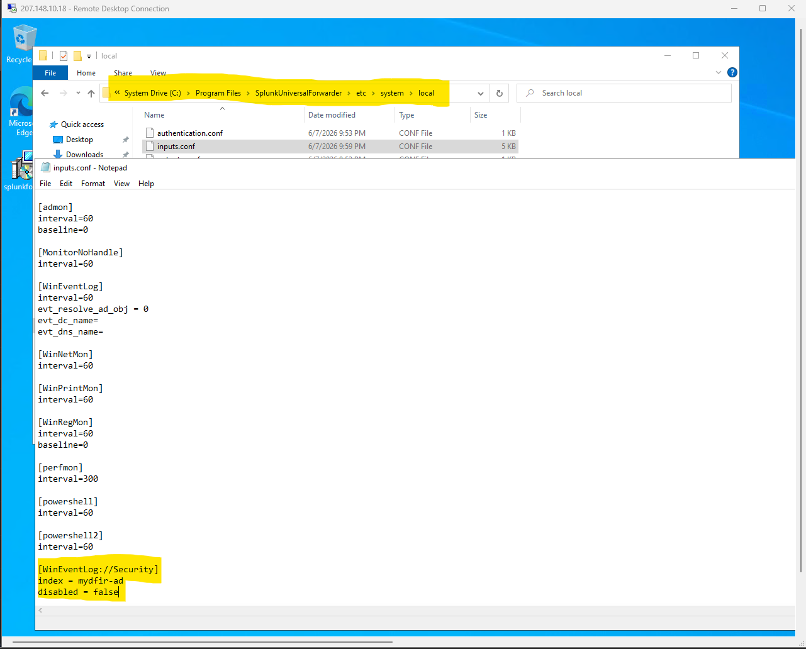

In `services.msc` (also opened elevated), the **SplunkForwarder** service was configured to run under the **Local System** account on the **Log On** tab, then restarted.

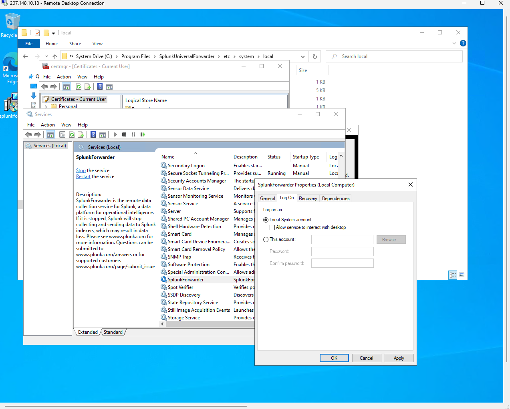

### Universal Forwarder deployment — domain controller

The same procedure was applied to the DC. Since the DC's interactive user is `Administrator`, the elevation prompts went away. The `inputs.conf` copy and stanza are identical; the service was restarted via `services.msc`.

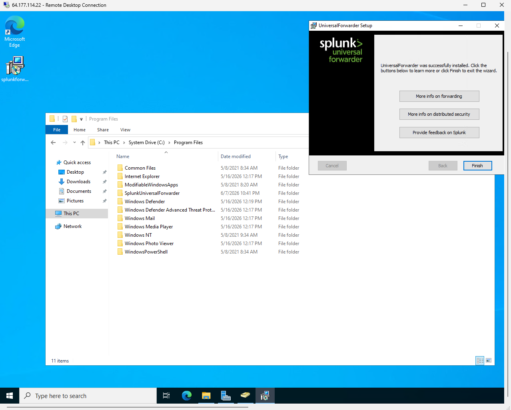
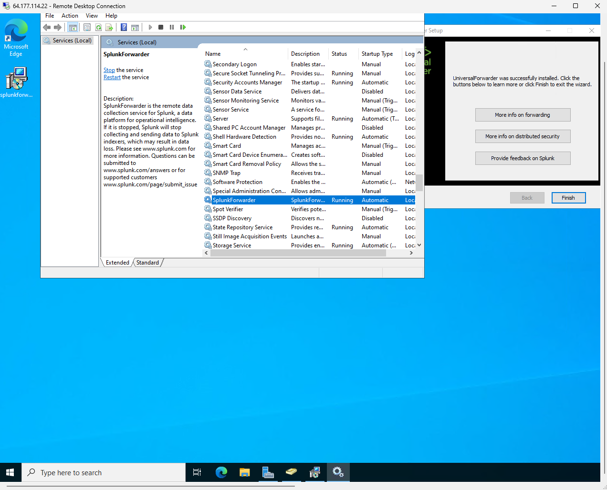

### Verifying telemetry

In Splunk web UI → **Apps → Search & Reporting**, ran:

```spl
index=mydfir-ad
```

First run returned zero events — the Ubuntu `ufw` was blocking 9997 inbound. Fix:

```bash
ufw allow 9997
```

After the second refresh, events started landing immediately. Under **Selected fields → host**, two values appeared:

- `mydfir-ad-dc01` (domain controller)
- `vultr-guest` (test machine)

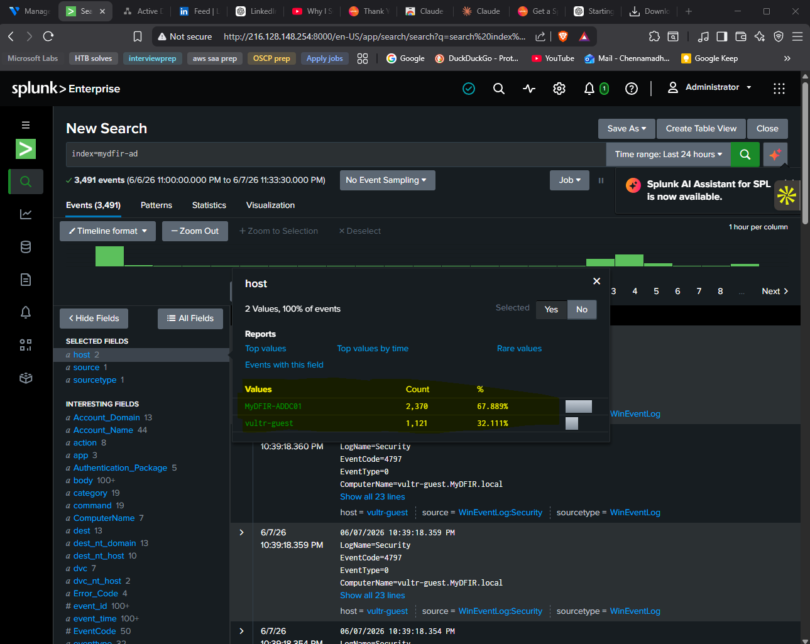
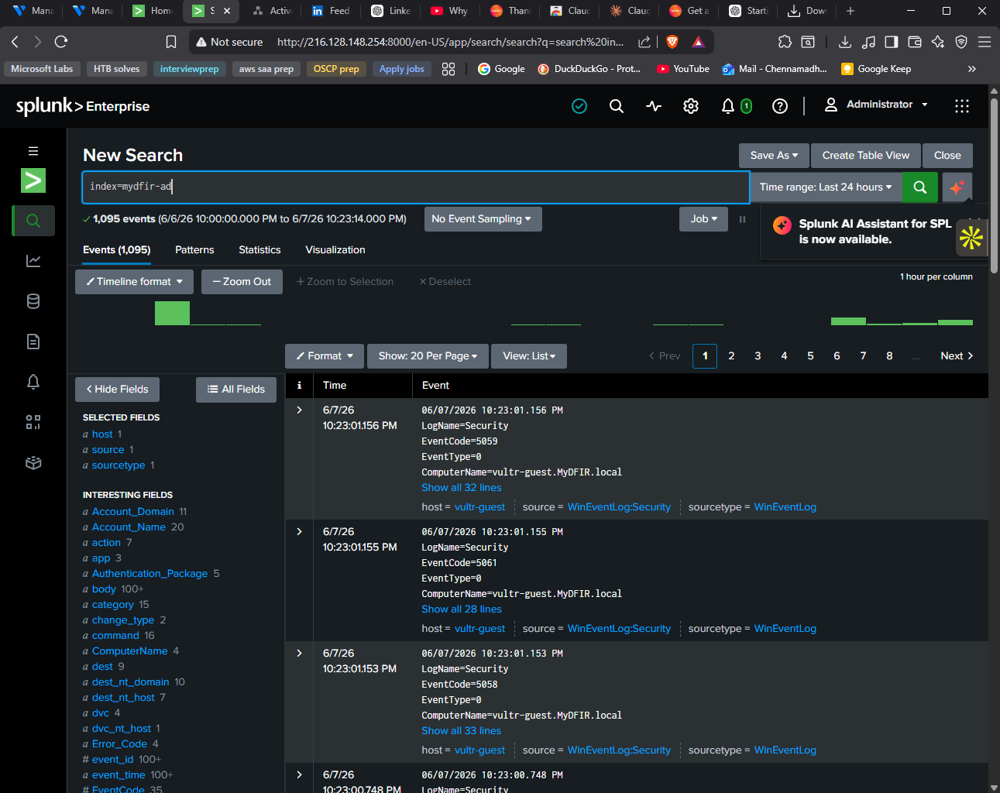

## Verification

This phase is complete when:

- `http://<splunk-public-ip>:8000` returns the Splunk login page (and only from the analyst's IP)
- The `mydfir-ad` index exists under **Settings → Indexes**
- 9997 is listed as an active receiving port under **Forwarding and receiving**
- `index=mydfir-ad` over the last 15 minutes returns events from both `host=mydfir-ad-dc01` and `host=vultr-guest`
- `EventCode` is parsed as a field (confirms the Windows add-on is doing its job)

## Troubleshooting

**Browser hangs on `<ip>:8000` even though the rule is in Vultr.** Two firewalls — also run `ufw allow 8000` on the Ubuntu host.

**`index=mydfir-ad` returns zero events.** Either the UF isn't sending or the indexer isn't receiving. Check `ufw status` on the Splunk host, check **Settings → Forwarding and receiving** confirms 9997 is enabled, and verify the **SplunkForwarder** service is running on the Windows side.

**Fields like `Logon_Type` and `Source_Network_Address` don't appear in events.** The **Splunk Add-on for Microsoft Windows** isn't installed. Without it, security events are indexed as raw XML and field extractions never fire.

**Universal Forwarder install errors out at the service-account step.** The installer is running under a non-admin user. Re-launch the MSI explicitly with domain admin credentials.

**Universal Forwarder installed but no events.** `inputs.conf` either isn't in `etc\system\local\` (only `default\`), or the stanza header is wrong (must be `[WinEventLog://Security]`, double slash). Save with Notepad elevated, restart the service.

## Key Concepts

- **Splunk index** — the on-disk data store that ingested events are written to. Indexes also serve as a permissions and retention boundary; `index=mydfir-ad` in a search means *look only at this dataset*.
- **Universal Forwarder** — a lightweight agent that ships local logs to a Splunk indexer over port 9997. It doesn't search or transform; it only ingests, optionally filters, and forwards.
- **`inputs.conf`** — the Splunk config file that says *which event sources to read*. The `[WinEventLog://Security]` stanza tells the forwarder to subscribe to the Security channel of the Windows event log and tag the events with the destination index.
- **Why GMT** — distributed timestamps are the hardest part of incident reconstruction. Forcing the indexer to a single canonical timezone (GMT) avoids a class of subtle off-by-one investigations.
