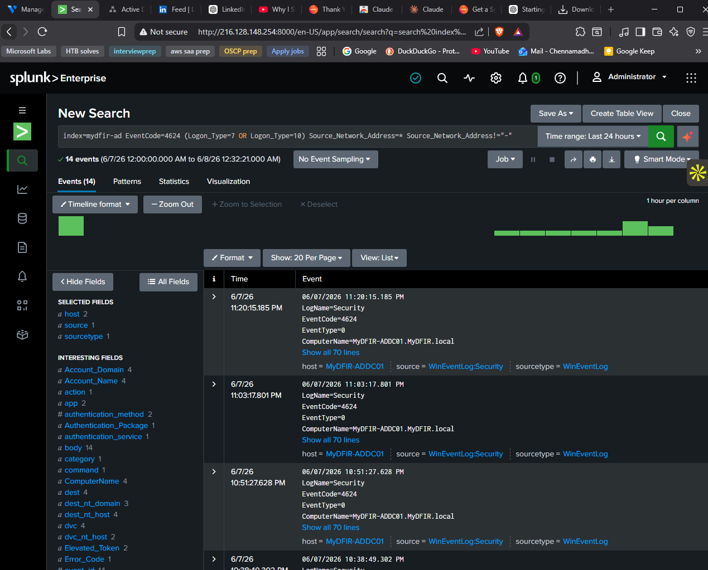
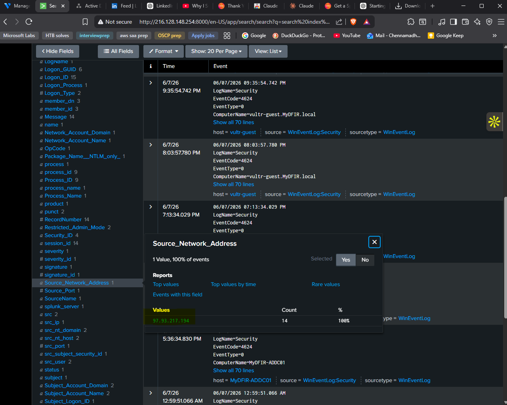
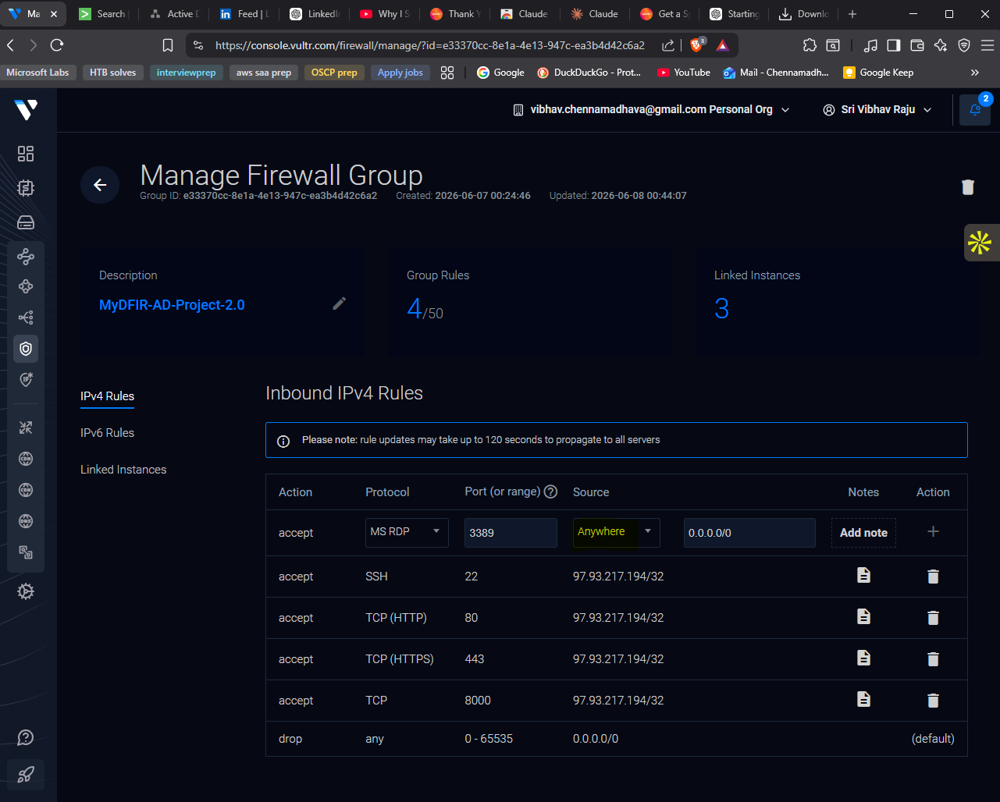
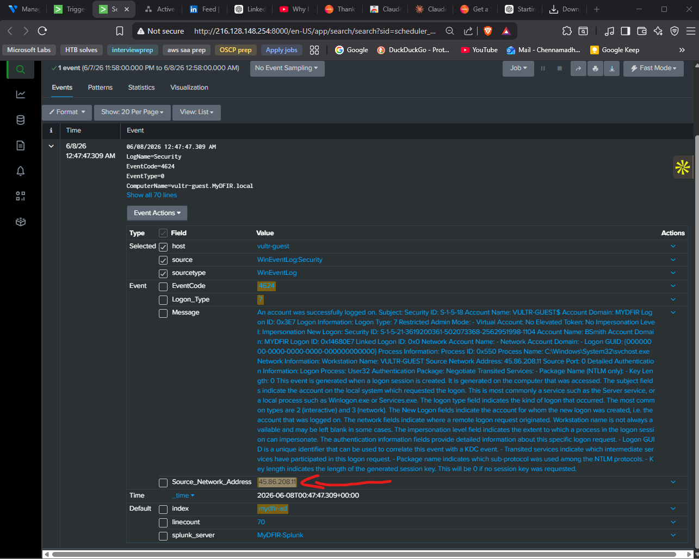
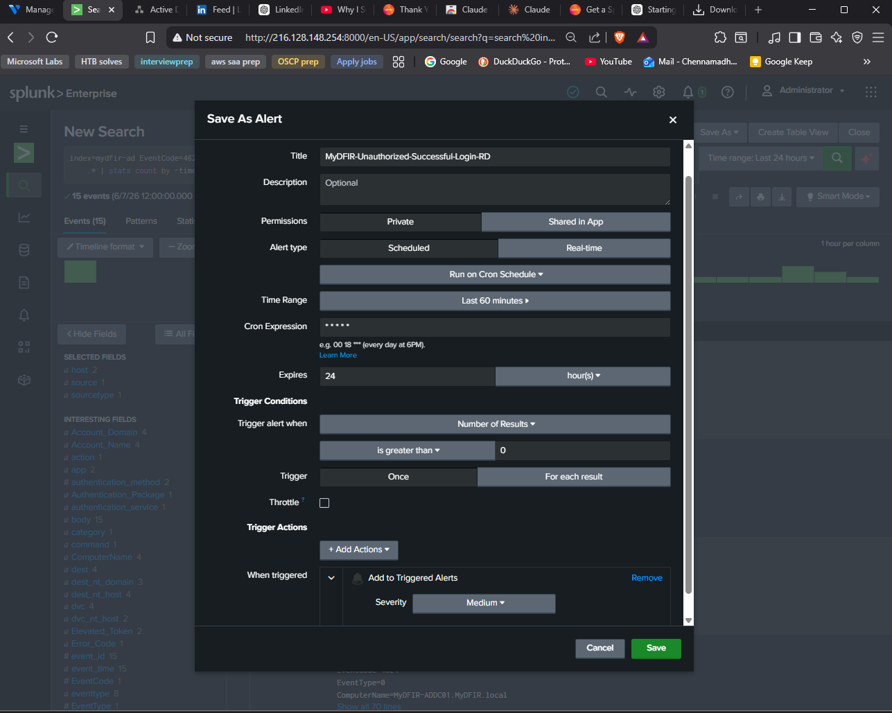
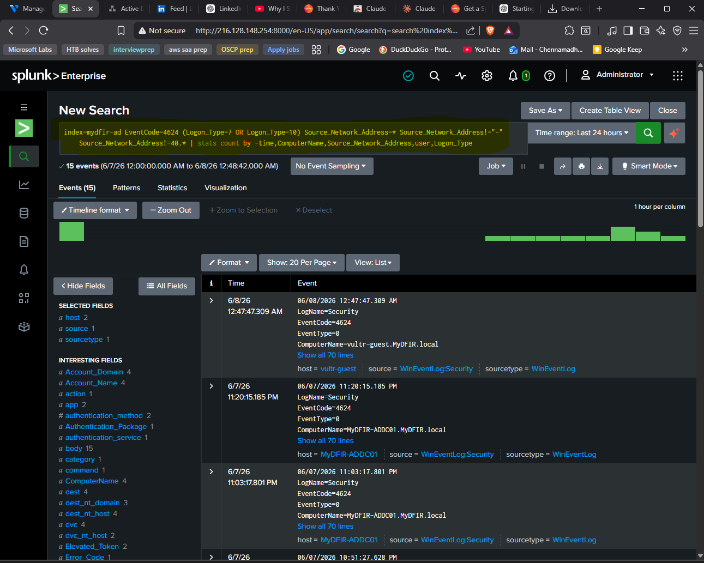
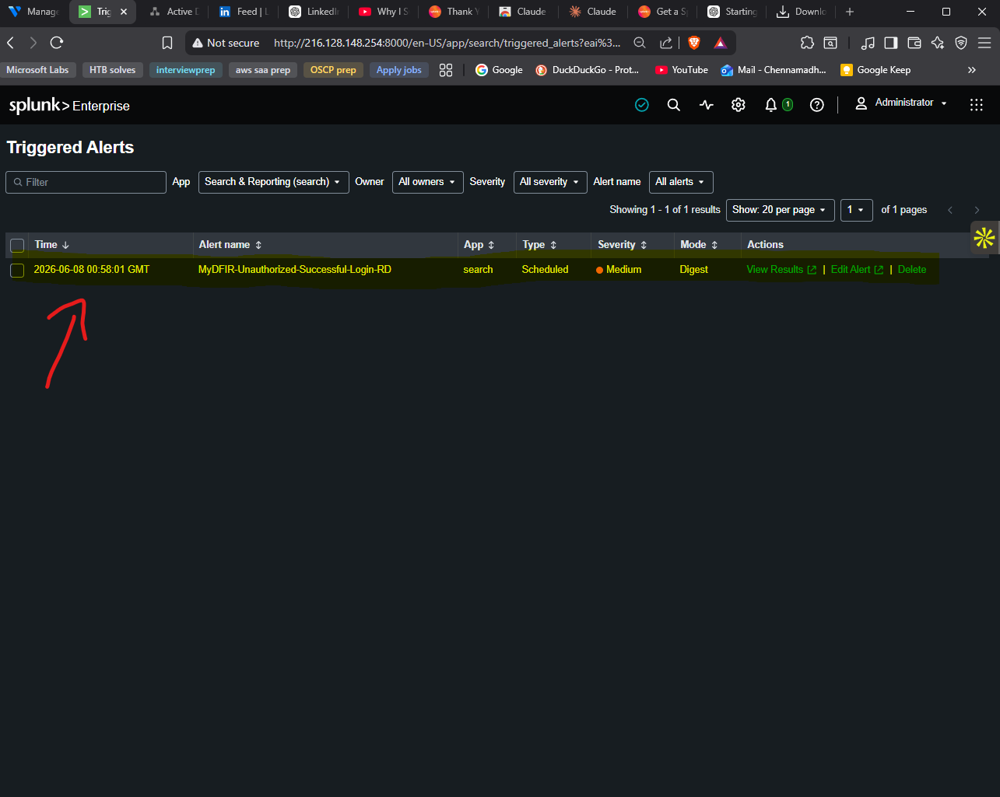

# Part 4 — Detection and Alerting

## Objective

This phase turns the raw Windows Security telemetry from Part 3 into a real SOC signal. A Splunk search is iterated against EventCode 4624 (successful logon) to filter down to interactive RDP-style logons originating from outside an "authorized" IP range, then saved as a scheduled alert that fires every minute. By the end of this phase the lab has an alert that the SOAR pipeline in Part 5 can react to.

## Prerequisites

- `index=mydfir-ad` returning events from both `mydfir-ad-dc01` and `vultr-guest`
- Splunk Add-on for Microsoft Windows installed (provides the `user`, `Logon_Type`, `Source_Network_Address` field extractions)
- Admin access to the Vultr firewall group (to widen RDP for test-data generation)
- A second device (or VPN endpoint) the analyst can RDP from to simulate an "unauthorized" source

## Steps

### Understanding EventCode 4624

Windows logs EventCode **4624** every time an account is successfully logged on. The volume on a busy host is enormous because it covers *every* logon type — service start, scheduled task, batch job, network share access, interactive console, RDP, all of them. The field that narrows it down to the activity worth alerting on is **Logon Type**:

| Logon Type | Meaning | Relevant to this alert? |
|------------|---------|-------------------------|
| 2 | Interactive (console) | No |
| 3 | Network (SMB, etc.) | No |
| 4 | Batch | No |
| 5 | Service | No |
| **7** | **Unlock** (incl. reconnected RDP session) | **Yes** |
| 8 | NetworkCleartext | No |
| 9 | NewCredentials | No |
| **10** | **RemoteInteractive** (RDP) | **Yes** |
| 11 | CachedInteractive | No |

Logon Type 10 is the headline RDP signal. Logon Type 7 is included because reconnecting to an existing RDP session emits a 4624/7 rather than a fresh 4624/10 — leaving 7 out would miss reconnect activity from the same attacker.

### Building the SPL search incrementally

Started in **Search & Reporting** with the broadest filter:

```spl
index=mydfir-ad EventCode=4624
```

This returned a flood of mostly-uninteresting logons. Added Logon Type filter:

```spl
index=mydfir-ad EventCode=4624 (Logon_Type=7 OR Logon_Type=10)
```

Narrowed to seven events, but several of them had no `Source_Network_Address` (local logons). Required the field to be present:

```spl
index=mydfir-ad EventCode=4624 
(Logon_Type=7 OR Logon_Type=10) 
Source_Network_Address=*
```

Then stripped the literal `"-"` value (Windows uses this as a sentinel for "no remote source"):

```spl
index=mydfir-ad EventCode=4624 
(Logon_Type=7 OR Logon_Type=10) 
Source_Network_Address=* 
Source_Network_Address!="-"
```



### Defining "unauthorized"

For the demo, the corporate office IP block is assumed to start with `40.`. Anything outside that prefix is *unauthorized*. This is exactly the kind of simple allowlist that breaks down in the real world (VPNs, work-from-home, vacation IPs) — for production it would be replaced with a CIDR-list lookup against an asset table.

```spl
index=mydfir-ad EventCode=4624 
(Logon_Type=7 OR Logon_Type=10) 
Source_Network_Address=* 
Source_Network_Address!="-" 
Source_Network_Address!=40.*
| stats count by _time, ComputerName, Source_Network_Address, user, Logon_Type
| sort -_time
```

The trailing `stats … by` is purely cosmetic. It collapses the noisy raw event into a five-column table that's easy to read in a triggered-alert email or a Discord post.



### Loosening firewall rules to generate test data

To prove the alert fires, the lab needed an RDP attempt from an "unauthorized" source. In **Vultr → Network → Firewall → Manage**, the existing MS-RDP rule scoped to *My IP* was deleted and re-added with **Source: Anywhere** so any internet IP could attempt to connect to the Windows hosts.

A separate computer was then connected to a commercial VPN (giving it a non-`40.*` egress IP) and RDP'd into the test machine using `MyDFIR\JSmith` / `Winter2025!`. The successful login generated a 4624 with Logon Type 10 and a non-corporate source IP — exactly the signal the search was written for.




### Saving as a scheduled alert

In Splunk, **Save As → Alert**:

- Title: `MyDFIR - Unauthorized - Successful - Login - RDP`
- Permissions: Private
- Alert type: Scheduled
- Schedule: **Cron** with `* * * * *` (every minute — chosen for fast feedback during testing; a real deployment would space this out)
- Time range: Last 60 minutes
- Trigger: number of results > 0
- Throttle: 24 hours per `Source_Network_Address` to avoid alert spam from a noisy attacker
- Trigger actions: **Add to Triggered Alerts**, severity *Medium*




Splunk warned *This scheduled search will not run after the Splunk Enterprise trial license expires* — acknowledged and saved.

### Verifying the alert fires

Opened **Activity → Triggered Alerts** in a new tab. After waiting roughly one minute, the page refreshed and showed the new triggered alert with the matching `Source_Network_Address`.



## Verification

This phase is complete when:

- The saved search returns the expected unauthorized-login rows when run manually
- The alert appears under **Settings → Searches, reports, and alerts** with the cron schedule
- A test RDP login from a non-`40.*` source IP triggers a row in **Activity → Triggered Alerts** within a minute
- No alert fires for an RDP login from the analyst's own (`40.*`-prefixed) IP

## Troubleshooting

**Search returns events but `Logon_Type` is `<no values>`.** The Splunk Add-on for Microsoft Windows is missing — the field extractions live in that app. Install it under **Apps → Find more apps**.

**Search matches no events.** Check that the index name in the search and in the Universal Forwarder's `inputs.conf` agree exactly (`mydfir-ad`, not `mydfir_ad` or `MyDFIR-AD`). The test machine's host name in events is `vultr-guest`, not the friendly Vultr label.

**Alert doesn't fire even after a matching login.** Run the search manually first with the same time range to confirm the matching event is actually indexed at the moment the schedule fires — there's a small ingestion delay between login and Splunk seeing the event. Bumping the time range from 5 minutes to 60 minutes covers this for testing.

**Too many duplicate alerts after one event.** The cron is too aggressive for the time window. Either widen the throttle (`throttle.fields=Source_Network_Address, throttle.suppress=24h`) or move from `* * * * *` to `*/5 * * * *`.

## Key Concepts

- **EventCode 4624** — *An account was successfully logged on.* The starting point for almost every authentication-related detection in a Windows environment. Pairs naturally with **4625** (failure) and **4634** (logoff) for correlation.
- **Logon Type 7 vs 10** — 10 is the textbook RDP session establish; 7 is the unlock/reconnect that an existing session emits. Detections that only key on Logon Type 10 quietly miss reconnect activity.
- **Cron schedule in Splunk** — `* * * * *` means *every minute*. Cron is the right tool when the alert needs sub-hour cadence; for hourly+ schedules Splunk's basic schedule picker is fine.
- **What "unauthorized" actually means** — an allowlist of source IPs (or, better, asset tags). Anything outside the list is suspicious. The hard part of this kind of detection in production is keeping the allowlist current.
