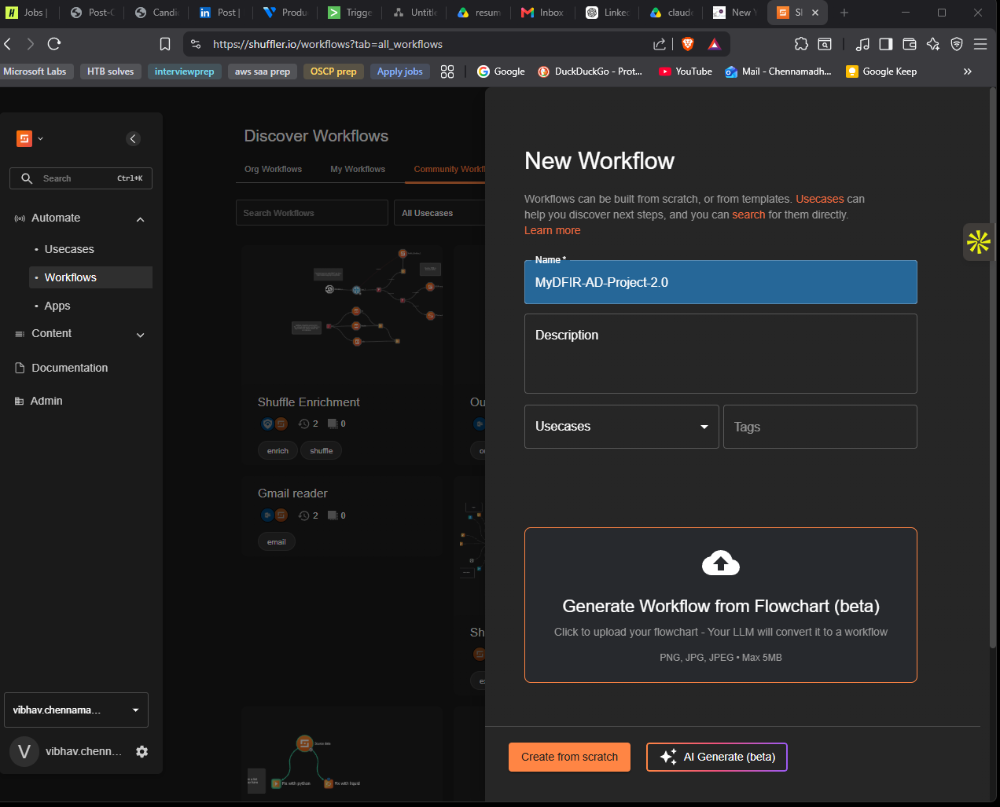
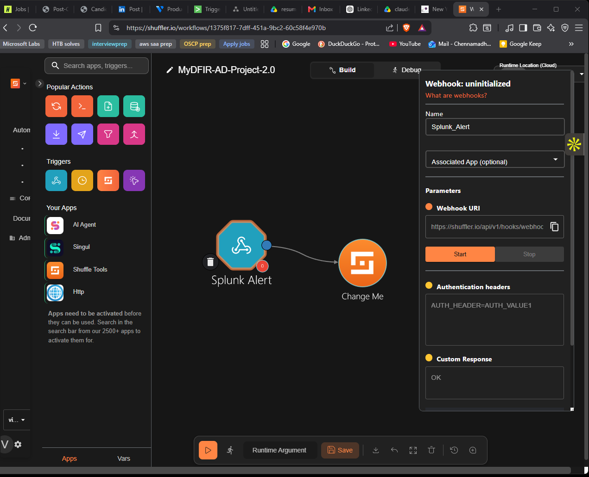
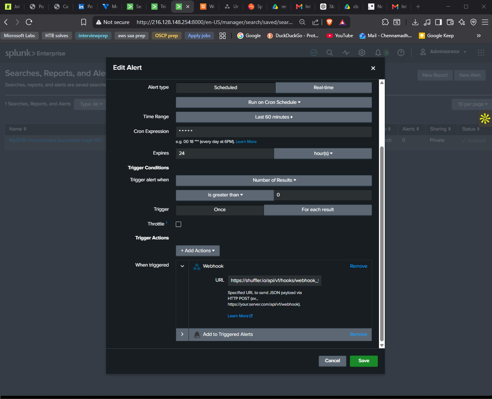
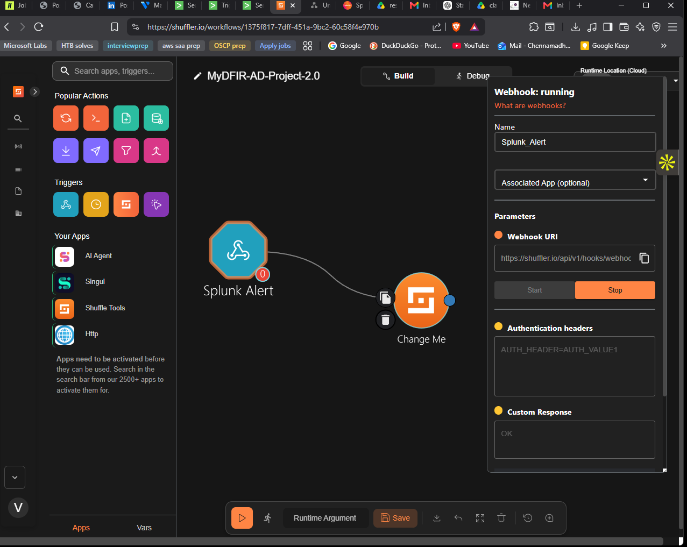
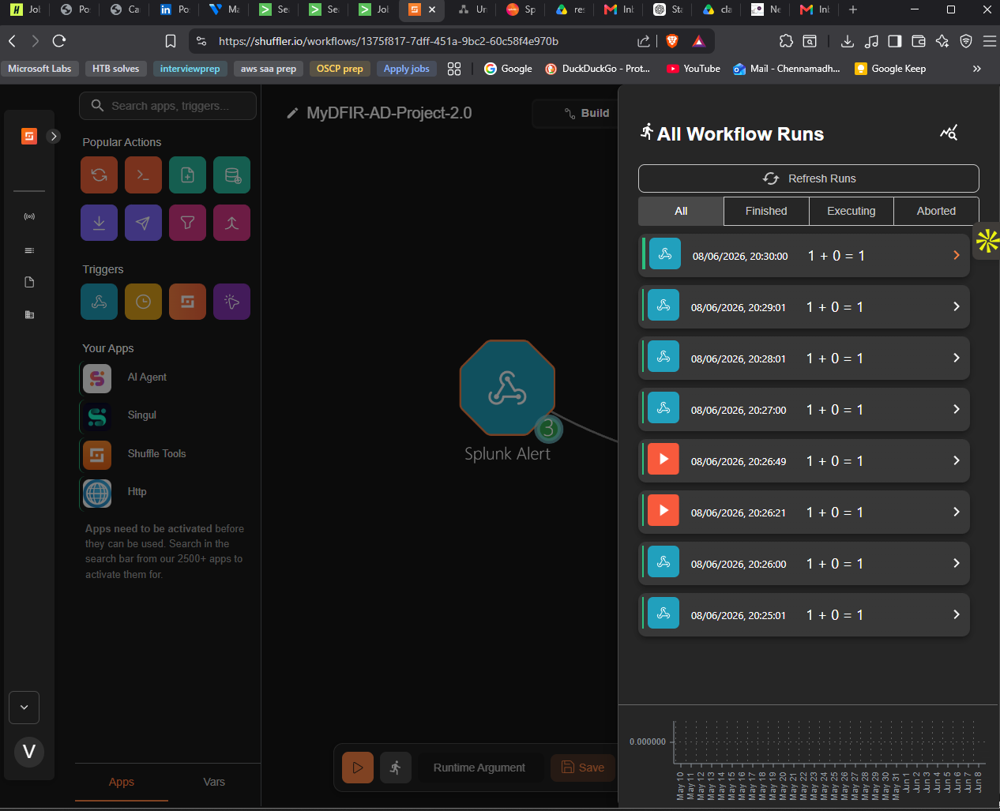
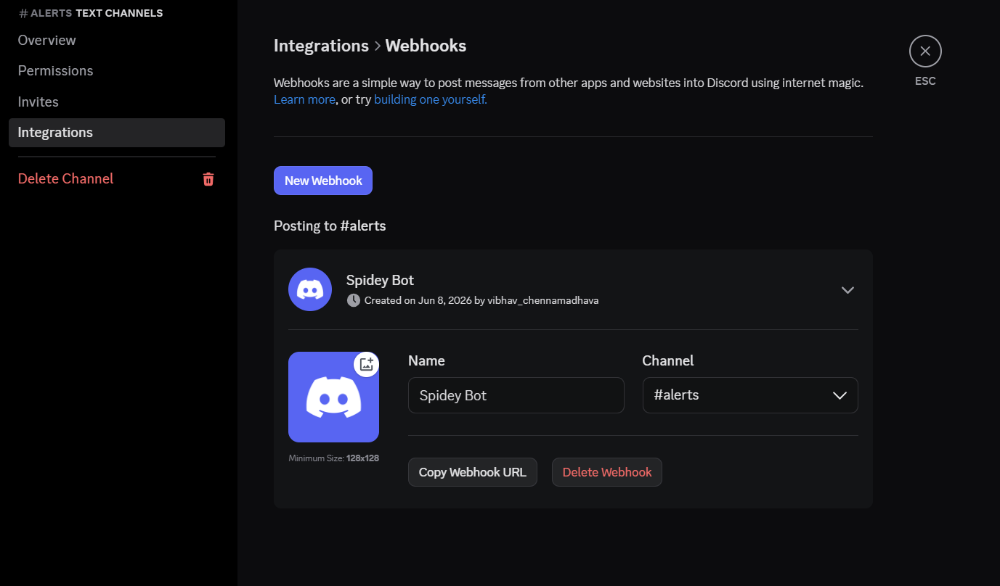
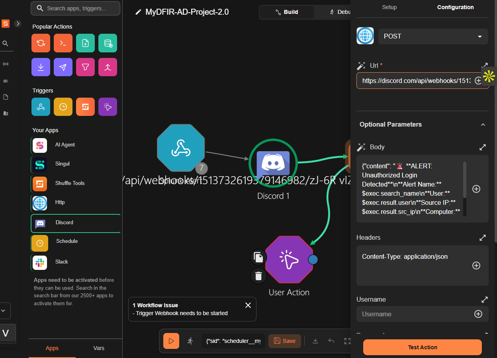
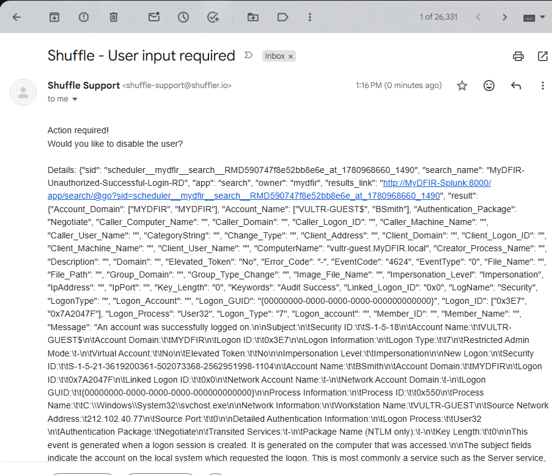
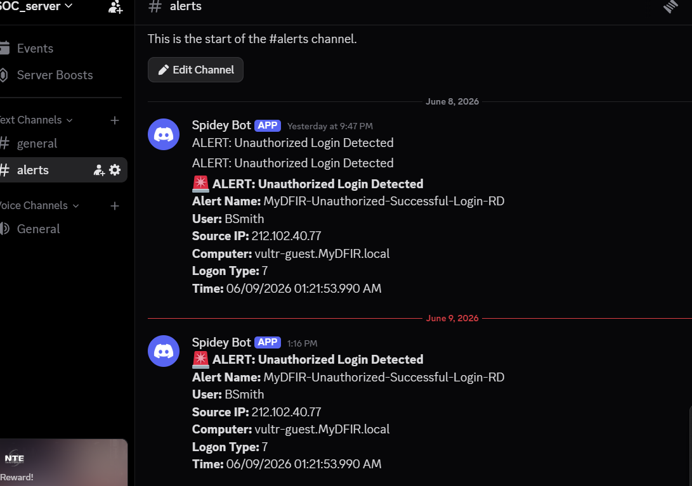
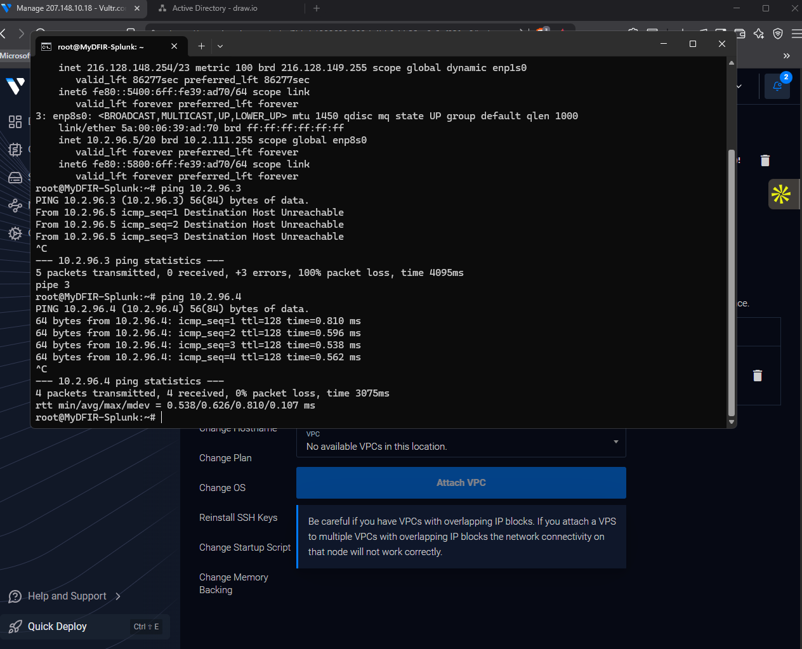

# Part 5 — SOAR Automation

## Objective

This phase wires the Splunk alert from Part 4 into a Shuffle SOAR workflow that performs an analyst-in-the-loop response: notify the SOC over Discord, email the analyst a yes/no remediation prompt, and on confirmation, disable the offending user in Active Directory via LDAP, then post a confirmation back to Discord. The point of the phase is less the disable action itself and more the *pattern*: SIEM → SOAR → human decision → response → confirmation. That pattern generalizes to almost every playbook a real SOC writes.

## Prerequisites

- Splunk alert from Part 4 saved and known to trigger on test traffic
- Shuffle SOAR account (https://shuffler.io — cloud is sufficient for the lab)
- A Discord account and a Discord server the analyst controls
- A throwaway/disposable email inbox the analyst can read (used for the user-input node)
- Domain admin credentials for `MyDFIR.local`
- LDAP (TCP/389) reachable on the DC from Shuffle's cloud egress range

## Steps

### Creating the Shuffle workflow

In Shuffle, **Workflows → Create Workflow → Name: `MyDFIR-AD-Project-2.0`**. The workflow opens to a blank canvas.



### Webhook trigger

Dragged the **Webhook** trigger onto the canvas and renamed it `Splunk-Alert`. Shuffle generated a unique webhook URI — copied to the clipboard.



### Wiring the Splunk alert to the webhook

Back in Splunk → **Search & Reporting → Alerts → MyDFIR-Unauthorized-Successful-Login-RDP → Edit Alert → Add Action → Webhook → URL: (paste Shuffle URI) → Save**.



The Shuffle webhook has to be in the **Started** state before it will accept inbound POSTs — clicked **Start** on the trigger node.



Re-enabled the Splunk alert. Within a minute the next triggered alert POST'd into Shuffle; **Explore Runs** showed the incoming payload with `search_name`, `user`, `Source_Network_Address`, `_time`, `Logon_Type`, `ComputerName` all available as runtime arguments under `$exec.result.*`.



### Slack OAuth failure → migrating to Discord

The original plan was to send alerts to Slack. The Shuffle Slack app's one-click login completed, the workspace was selected, but adding the bot to the workflow returned an *Invalid permissions* error during the OAuth scope grant. The free Slack workspace tier wouldn't approve the bot scopes Shuffle's connector requests. After about ten minutes of poking at workspace admin settings, swapped to Discord.

**Creating the Discord destination:**

1. New Discord server: `MyDFIR Lab`
2. New text channel: `#alerts`
3. Channel settings → **Integrations → Webhooks → New Webhook → Name: `Splunk-Alerts` → Copy Webhook URL**



**Posting to Discord from Shuffle:** dragged an **HTTP** node onto the canvas (Shuffle doesn't ship a first-class Discord app, but the incoming-webhook API is a simple `POST application/json`). Configuration:

- Method: `POST`
- URL: the Discord webhook URL
- Headers: `Content-Type: application/json`
- Body:

```json
{
  "content": "**Alert:** $exec.result.search_name\n**Time:** $exec.result._time\n**User:** $exec.result.user\n**Source IP:** $exec.result.Source_Network_Address\n**Logon Type:** $exec.result.Logon_Type"
}
```

Connected the webhook trigger to this HTTP node. The runtime-argument tokens (`$exec.result.*`) are interpolated by Shuffle at execution time using the field values from the Splunk payload.



Test fire: re-triggered the Splunk alert. Discord `#alerts` channel received a formatted alert message immediately.

### Email user-input node

Added the built-in **User Input** trigger, named it `Analyst-Decision`:

- Question: *"Would you like to disable the user?"*
- Channel: **Email** (Slack option still showed but wasn't connected)
- Email recipient: disposable analyst inbox

Connected the Discord HTTP node → User Input.

Re-ran the workflow. The email arrived with the full alert context inline and two clickable links: True / False. Clicking True returns the analyst's decision to the workflow and resumes execution at the next node.



### Active Directory node — disable the user

Searched the app library for **Active Directory** and dragged it onto the canvas after the User Input. Configuration of the LDAP authentication:

| Field | Value |
|-------|-------|
| Server | `<DC public IP>` (later switched to private after the LDAP rule was opened) |
| Port | `389` |
| Domain | `MyDFIR` |
| Logon user | `Administrator` |
| Password | (DC admin password from Vultr panel) |
| Base DN | `CN=Users,DC=MyDFIR,DC=local` |
| Search base | `CN=Users,DC=MyDFIR,DC=local` |
| Use SSL | `false` |

The base DN was confirmed against the DC with PowerShell:

```powershell
Get-ADDomain
```

Action selected: **Disable User**. Account name mapped to the runtime argument `$exec.result.user` from the Splunk payload (i.e., `JSmith`).

**MD4 cloud limitation.** The first run failed with a Python `hashlib` exception referencing MD4 — Shuffle's cloud worker uses an OpenSSL build with MD4 disabled, and the LDAP NTLM bind path calls into it. Workaround was to fall back to a **simple bind** with the direct administrator credentials and `useSSL=false` (the same bind type used for the **Get User Attributes** call below, which doesn't go through the NTLM path). Bind succeeded, disable succeeded. The proper fix for this beyond the lab is to self-host the Shuffle worker so the Python image is under the user's control.

### Confirmation: Get User Attributes + branch

After the Disable User step, the workflow can't just *assume* the disable succeeded — the SOAR has to check. Added a second Active Directory node configured for **Get User Attributes**, with the same authentication. Looked at the response for the user — `userAccountControl` carries the bit flags that include `ACCOUNT_DISABLED`.

Added a conditional branch with the condition:

```
$get_user_attributes.userAccountControl contains "ACCOUNT_DISABLED"
```

If true → fall through to the Discord confirmation node.
If false → end (silent — no spam).

### Discord confirmation

A second Discord HTTP node:

- Method: `POST`
- URL: the same Discord webhook URL
- Body:

```json
{ "content": "Account: $exec.result.user has been disabled." }
```

### End-to-end test

1. Re-enabled the Splunk alert.
2. Confirmed `JSmith` was *enabled* in ADUC.
3. RDP'd into the test machine from a non-`40.*` source.
4. Splunk fired within 60 seconds.
5. Discord `#alerts` received the alert payload.
6. Disposable inbox received the *Would you like to disable the user?* email.
7. Clicked **True**.
8. Shuffle's AD node fired the Disable User call.
9. Refreshed ADUC — `JSmith` showed the *disabled* down-arrow icon.
10. Discord `#alerts` received the confirmation: *Account: JSmith has been disabled.*




## Verification

This phase is complete when:

- Triggering the Splunk alert posts the formatted payload to the Discord `#alerts` channel
- The analyst email arrives within seconds of the Discord alert
- Clicking **True** in the email actually disables `JSmith` in ADUC
- A confirmation message lands in Discord *only after* the disable check passes
- Clicking **False** ends the workflow silently without touching AD

## Troubleshooting

**Slack one-click login returns *Invalid permissions*.** Free Slack workspaces don't always grant the bot scopes Shuffle requests. Don't waste time — swap to Discord (incoming webhook → HTTP node), no OAuth required.

**Active Directory node fails with MD4 / hashlib error.** Shuffle cloud worker's Python OpenSSL build has MD4 disabled. Use a simple bind (admin user/password) with `useSSL=false` for the lab. Long term, self-host Shuffle.

**`list index out of range` on the AD node.** The base DN or search base field is empty. Both have to be set; `CN=Users,DC=MyDFIR,DC=local` is the default users container for the lab forest.

**Workflow runs slack/discord before the user input arrives.** Shuffle executes branches in the order they connect. A node that should wait for an answer needs to be wired *downstream* of the User Input node, not in a parallel branch.

**Disable User succeeds but no confirmation message in Discord.** The conditional branch isn't matching. The `userAccountControl` field is a bitmask serialized as a string — match on `contains "ACCOUNT_DISABLED"` (the human-readable token Shuffle expands it to), not on a raw integer.

**Confirmation message fires before the disable actually applies.** Add a small delay node before the Get User Attributes step, or chain the Get User Attributes off the Disable User node's *success* output specifically so it doesn't race.

---

## Active Directory Integration — Known Limitation

An Active Directory node was added to the Shuffle workflow to
automatically disable the flagged user account upon analyst approval.
The node was configured with the domain controller's public IP,
LDAP port 389, domain administrator credentials, and base DN of
`CN=Users,DC=MyDFIR,DC=local`.

During testing, the node consistently failed with the following error:


*Shuffle SOAR returning a ValueError for unsupported MD4 hash type
when attempting LDAP authentication against the Windows domain controller*

```json
{
  "success": false,
  "exception": "ValueError - unsupported hash type MD4",
  "reason": "An exception occurred while running this function (2)."
}
```

**Root Cause:** Shuffle's cloud-hosted Python runtime uses a hardened OpenSSL build with MD4 disabled due to cryptographic deprecation. Windows Active Directory's LDAP authentication relies on NTLM, which internally requires MD4 hashing — creating a direct incompatibility between Shuffle cloud and on-premises AD over standard LDAP port 389.

**What was verified:** The Vultr firewall was confirmed open on port 389, the Windows DC firewall allowed inbound LDAP, LDAP signing was set to None in Group Policy, and multiple credential combinations were tested. The error persisted regardless — confirming this is a Shuffle cloud platform limitation rather than a configuration issue.

**Impact on workflow:** The Discord alert notification, email analyst prompt, and User Input decision node all functioned correctly. The AD disable step represents the final action in the automation chain and is the only component that could not be completed via Shuffle cloud.

**Path forward:** Documented under Future Improvements below — self-hosting Shuffle via Docker resolves this completely.

## Future Improvements

The following enhancements are planned to extend the lab's capability and resolve known limitations:

- [ ] **Self-hosted Shuffle (Priority)** — Deploy Shuffle via Docker on the Ubuntu lab VM to resolve the MD4 LDAP limitation. Local Python environments allow MD4 through legacy OpenSSL configuration, enabling full end-to-end automated AD user disable without any cloud platform restrictions
- [ ] **Complete the AD Disable Chain** — Once Shuffle is self-hosted, finish the full workflow: analyst approves → AD disables user → Get-User-Attributes confirms disabled status → Discord posts confirmation. This closes the loop on the entire response playbook
- [ ] **Brute Force Detection Playbook** — Expand Splunk detection to EventCode 4625 (failed logon). A threshold of 5+ failures within 60 seconds from a single source IP would trigger a medium-severity alert, with a separate Shuffle workflow to temporarily block the IP via firewall API
- [ ] **Threat Intel Enrichment** — Add an AbuseIPDB or VirusTotal API call as a Shuffle node between the webhook trigger and the Discord notification. This would automatically tag the source IP with a threat score and known abuse reports before the analyst sees the alert — reducing triage time
- [ ] **Splunk Security Dashboard** — Build a dedicated Splunk dashboard with panels for: RDP login volume over time, top unauthorized source IPs, user accounts most frequently targeted, alert trigger history, and logon type breakdown
- [ ] **Wazuh HIDS Integration** — Deploy Wazuh agents on both Windows endpoints alongside Splunk forwarders. Wazuh adds file integrity monitoring, rootkit detection, and compliance checks — forwarding alerts to Splunk for unified correlation
- [ ] **pfSense Network Segmentation** — Add a pfSense VM as a perimeter firewall between the lab segments. This generates firewall log telemetry for Splunk ingestion and more closely mirrors a real enterprise network architecture
- [ ] **Email Analyst Prompt Completion** — Implement the full Shuffle email-based analyst response where the analyst receives a formatted email with True/False hyperlinks. Clicking the link directly triggers the corresponding Shuffle branch without requiring any manual workflow interaction

## Key Concepts

- **SOAR webhook trigger** — a no-code way to receive structured alerts from any system that can `POST` JSON. The webhook is the contract between SIEM and SOAR; everything downstream operates on the deserialized payload.
- **Runtime arguments (`$exec.result.*`)** — Shuffle's templating syntax for substituting fields from the trigger payload into downstream node configuration. Lets the same workflow handle many alerts without hardcoding values.
- **Analyst-in-the-loop response** — instead of auto-remediating, the workflow pauses and asks. The user-input node is the cheap way to inject human judgment between detection and action. For high-confidence detections it can be removed; for ambiguous ones it's essential.
- **`userAccountControl` bit flags** — Active Directory packs account state into a single integer attribute. `ACCOUNT_DISABLED` (`0x2`) is the bit checked here; ADUC's *Disable Account* action toggles it.
- **Discord incoming webhooks** — URL-only, no auth, JSON body. Excellent for SOC notification channels in a lab; the equivalent in production is usually a real chatops integration (PagerDuty, Slack with proper scopes, MS Teams).
